# Event-based Video Reconstruction via Potential-assisted Spiking Neural Network

> CVPR 2022
>
> 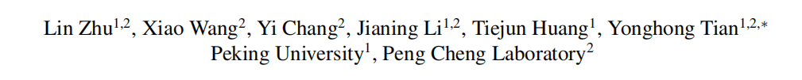

> 神经形态视觉传感器是一种新的仿生成像范式，报告高，称为“事件”，高时间分辨率和高动态范围。到目前为止，基于事件的图像重建方法是基于人工神经网络（ANN）或手工制作的时空平滑技术。在本文中，**我们首先通过深度峰值神经网络（SNN）架构来实现图像重建工作**。作为仿生神经网络，snn以异步的二进制峰值分布，可能会在事件驱动的硬件上导致更高的计算效率。我们提出了一种新的基于事件的视频重建框架，基于一个全尖峰神经网络（EVSNN），利用泄漏-集成和点火（LIF）神经元和膜电位（MP）神经元。我们发现，尖峰神经元有潜力存储有用的时间信息（记忆）来完成这种依赖时间的任务。此外，为了更好地利用时间信息，我们提出了一种利用spi的膜电位的混合电位辅助框架（PA-EVSNN）
>
> `pdf`:<https://pan.baidu.com/s/1eAHSKh87aEwIKDwbYcEHWA?pwd=u5cs>

## 3.方法

### 3.1输入表示

要利用 SNN 处理异步事件，需要将事件数据转换为包含时间信息的事件表示。在这项工作中，我们使用连续体素网格 [65] 来训练和测试我们的模型，其定义如下： $E(x, y, t_n) = ∑_i p_i max(0, 1-|t_n - t^∗_i|)$，其中 $t^∗_i = {B-1\over ∆T} (t_i - t_0)$，$t^∗_i$ 是归一化的事件时间戳。如图 1 所示，事件流可以自适应地划分为连续的体素网格。

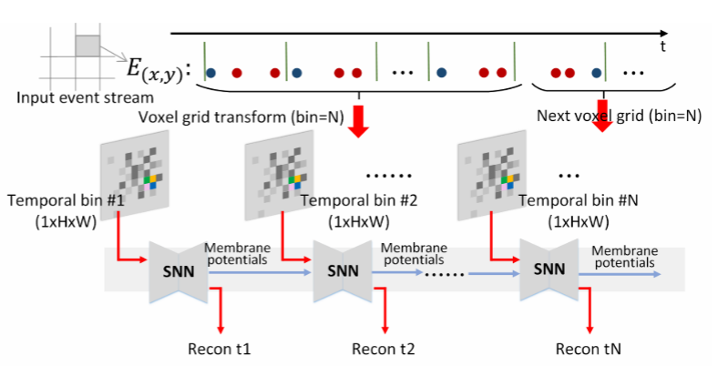

图 1. 我们框架的事件表示和工作流程。事件流（红/蓝点分别代表开/关事件）被分割成多个窗口，并转化为连续的体素网格。每个体素网格包括 N 个具有不同信息的时间分区。我们的 SNN 循环利用每个尖峰神经元的当前单通道时间仓和最后一次膜电位，在每个时刻生成新的重构。

### 3.2尖峰神经元

ANN 和 SNN 可以模拟相同类型的网络拓扑结构，但 SNN 用尖峰神经元模型取代了人工神经元模型。**人工神经元模型对输入加权和进行运算，并将结果通过sigmoid 或 ReLU 非线性传递**。在 SNN 中，输入的加权和对尖峰神经元的膜电位有贡献。如果尖峰神经元的膜电位达到阈值，那么该神经元就会向其后续连接发出尖峰脉冲。SNN 中的信息是通过离散的尖峰传播的，因此尖峰神经元是基本的计算单元。

LIF (Leaky integrated -and- fire)模型[12]是SNN中广泛应用的神经元模型，它比IF (integrated -and- fire)模型在生物学上更加真实。LIF神经元的亚阈值动力学定义为$τ {dV(t)\over dt} =−(V(t)−V_{rest}) +X(t)$，其中V(t)为神经元在t时刻的膜电位，X(t)为神经元的输入，τ为膜时间常数。当V(t)超过阈值Vth时触发，$V_{rest}$是触发后的静息电位。为了更好地表示，我们将上面的方程重写为离散形式:

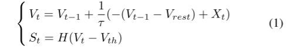

其中，Vt为t时神经动力学后的膜电位，St为t时的脉冲输出，H(·)为Heaviside阶跃函数，x≥0时定义为H(x) = 1, x < 0时定义为H(x) = 0。我们在工作中设置了$V_{rest} = V_{reset}$。LIF神经元在整合和放电过程中可以提取时间信息，但其输出的是二进制尖峰，只能代表有限的信息。此外，每次发射过程后，$M_t$会被重置，因此时间信息也会部分丢失。在此基础上，我们介绍了膜电位神经元。

**膜电位神经元** **膜电位神经元（MP）是一种非尖峰神经元，它输出的是膜电位而不是尖峰**[51, 58]。在我们的图像重建任务中，膜电位神经元可以提取隐藏在神经元中的更多有用的时间信息。MP 神经元的动态特性与 LIF 神经元相同。对于 MP 神经元，由于不存在尖峰发射和 Vt 复位过程，因此 $M_t$ 等于 $V_t$。如果设 $V_{rest} = 0$，公式 1 可写成

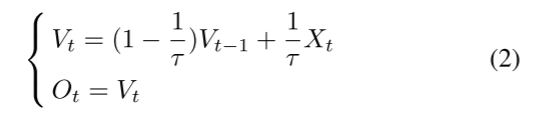

式中，Ot表示t处神经元的输出。式2类似于循环神经网络的函数。膜时间常数τ控制着记忆Xt和遗忘Vt−1之间的平衡。因此，它可以被看作是LSTM模块[16]的一个简单版本。

### 3.3提出的SNN模型

> 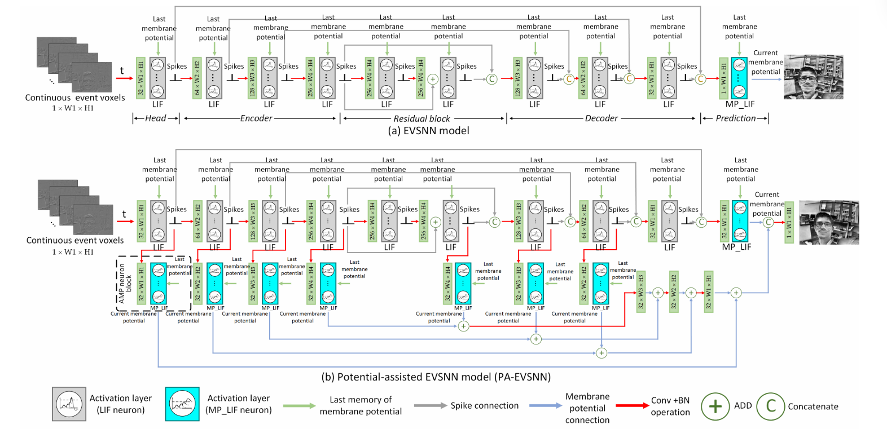
>
> 图3。提出的尖峰神经网络结构。EVSNN是一种全尖峰神经网络，由头部层、编码器层、残差块层、解码器层和预测层组成。PA-EVSNN以EVSNN为骨干，引入MP神经元进一步提高性能。MP LIF表示MP神经元具有LIF的动态变化。由于MP神经元引入了浮点乘法运算，我们认为PA-EVSNN是一种混合网络。EVSNN和PA-EVSNN的计算效率分别比它们的ANN结构高19.36 ×和7.75 ×。有关网络架构的详细信息，请参阅我们的补充资料

本文提出了两种基于事件重构的网络结构，即EVSNN和PA EVSNN。EVSNN是一个全尖峰神经网络，网络中所有的突触操作都是SNN操作。PA-EVSNN采用了相同的尖峰编码和解码器架构，并增加了MP神经元以提高性能。两种模型均为全卷积网络，其结构如图3所示。

> 
>
> 图2。LIF神经元和MP LIF神经元的动力学。对于LIF神经元来说，如果膜电位达到一个阈值，则该神经元将向随后的连接发出一个脉冲，并重置为静息状态。在每一个时间步长，MP LIF神经元输出其膜电位为输入脉冲的加权和。

EVSNN（完全尖峰神经网络 我们的 EVSNN 是 U 型模型的变体[44]。首先，将事件数据转换为事件体素。在每个时间步长内，一个 1×W×H 的事件体素被输入 EVSNN 并转换为 $N_c×W_1×H_1$ 的大小，然后是 $N_e$ 个编码器层、$N_r$个残差块、$N_d$个解码器层和最后的图像预测层。每个编码器层之后的通道数加倍。编码器层、解码器层和残差块中的所有尖峰神经元都是 LIF 神经元，从而提高了计算效率。为了确保完全的 SNN 架构，EVSNN 利用连接作为尖峰跳接。在最后的图像预测层，引入了 MP LIF 神经元来整合所有尖峰并预测灰度图像。每个网络组件的消减可参见第 4.4 节。我们使用 $N_c = 32$、$N_e = N_d = 3$ 和 $N_r = 1$。EVSNN 可以处理现有数据集中的大多数场景，计算效率是 ANN 架构的 19.36 倍。

**PA-EVSNN （Potential-assisted EVSNN）** EVSNN 是一种完全 SNN，能耗非常低。然而，其重建性能受到二值尖峰的限制（例如，图像灰度不够丰富）。在 EVSNN 的基础上，我们进一步提出了电位辅助 EVSNN 模型。在每个编码器和解码器层中引入 MP 神经元，以帮助提取隐藏在尖峰中的时间信息。我们还提出了自适应膜电位（AMP）神经元，它大大增强了网络的时间感受野。请注意，虽然 PA-EVSNN 的骨干是 SNN 架构，但 MP 神经元的引入为网络带来了非二进制尖峰（约占 ANN 浮点运算的 8.4%），因此我们将 **PA-EVSNN 视为混合网络**。与现有的 ANN 模型相比，PA-EVSNN 在性能相当的同时，在能耗方面仍有很大的优势（效率高 7.75 倍）。有关 SNN 和 ANN 运算的更详细分析，请参见第 4.5 节。

**自适应膜电位神经元** 正如第 3.2 节所分析的，MP 神经元中的膜时间常数 τ 与 LSTM 模块中的门具有类似作用。[10] 通过在分类任务中引入可学习的 τ，提出了参数 LIF 神经元。受此启发，我们提出了自适应膜电位神经元（AMP 神经元）。与参数 LIF 神经元从训练数据集学习的固定 τ 不同，AMP 神经元可以根据输入尖峰调整 τ 以适应各种重建场景。

> 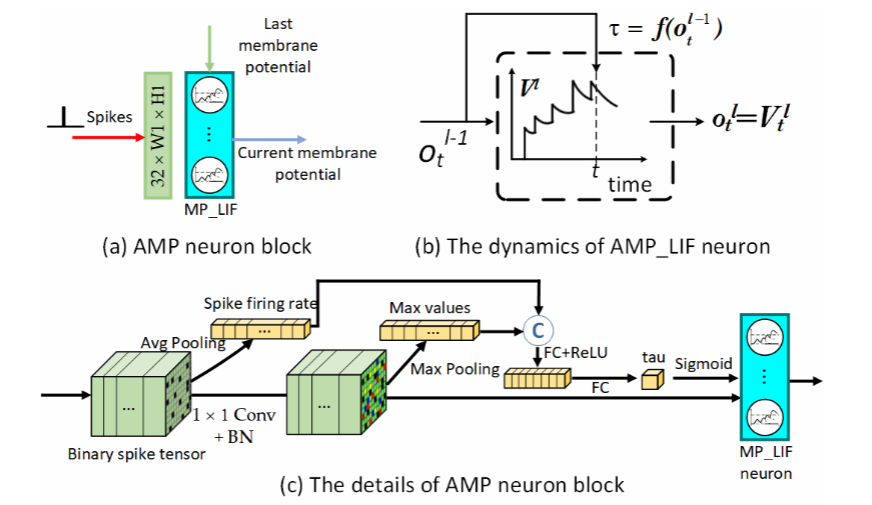
>
> 图4。自适应膜电位(AMP)神经元阻滞。(a)图3中的AMP神经元阻滞。(b) AMP LIF神经元的动力学。膜时间常数τ由输入$o^{l−1}_t$进行调整。(c) AMP神经元阻滞的细节。

根据公式2，理想情况下，当光线变化快时，网络应该选择一个较大的τ来记住更多的新信息，同时忘记更多的上一个记忆，反之亦然。由于事件测量的是光强的变化，平均脉冲发射率在一定程度上反映了场景的整体运动，这对于估计正确的τ是有用的。通过**F =** AvgPool($S_l$)可以估计出第l层每个通道的脉冲触发率，其中AvgPool(·)表示平均池操作，$S_l$为第l层的脉冲张量。那么可以通过**I =** MaxPool(Conv($S_l$))来估计输入峰值的局部运动强度，其中MaxPool(·)表示max pooling操作。最后，膜时间常数（tau，τ）由

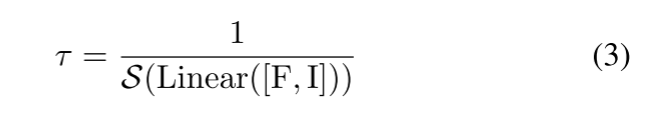

其中，S(-) 表示 sigmoid 激活函数，Linear(-) 是图 4 所示的全连接层。

**损失函数** 我们使用 LPIPS 损失和时间一致性损失： $L_{total} = ∑^L_{k=0}L^R_k + λ∑^L_{k=L_0}L^{TC}_k$，其中 $L^R_k$是 LPIPS 损失[60]，$L^{TC}_k$是时间一致性损失[22, 43]。

### 3.4. SNN 的训练细节

在训练过程中，我们将loss函数中的L设为训练序列长度(即40 - 60)，$L_0$设为2。在每个时间步中，一个大小为$1 ×H_1 ×W_1$的事件体素被输入到网络中。根据公式4，反向传播的误差使用BackPropagation through Time (BPTT)[56]通过尖峰神经元层和MP神经元层。在BPTT中，网络对所有离散时间步展开。每5个时间步长计算一次损失，每个时间步长的梯度和计算权值更新，如下所示:

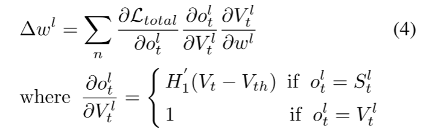

其中，$o^l_t$是t时刻神经元的输出，$∂o^l_t\over ∂V^l_t$表示脉冲在t时刻充电后对膜电位的导数。由于$∂o^l_t\over ∂V^l_t$是不可微的，我们采用替代梯度法[31]来计算。利用移位的ArcTan函数$H_1(x) = {1 \over π} arctan (πx)+{ 1\over 2}$作为Heaviside阶跃函数H(·)的替代函数。如果神经元是尖峰神经元，我们有。否则，如果神经元是MP神经元，没有脉冲输出，那么$o^l_t = V^l_t$，我们得到$∂o^l_t\over ∂V^l_t$= 1，这类似于一个ANN激活函数。

## 4.实验

### 4.2公共数据集评价

我们在三个公共数据集IJRR[29]、MVSEC[64]和HQF[50]上评估了我们的模型。在[43]和[48]之后，为了保证强度值在一个相似的范围内，我们对输出帧和groundtruth帧都进行了直方图归一化处理。此外，为了使重建的时间戳和groundtruth严格一致，我们使用相邻两帧之间的事件来生成每一个重建。我们将我们的模型与四种最先进的方法E2VID[43]、FireNet[48]、SPADE-E2VID[6]和E2VID+[50]进行比较。所有的结果都是由原论文的预训练模型生成的。我们使用均方误差(MSE)、结构相似度(SSIM)[54]和感知相似度(LPIPS)[60]度量来比较重建图像和基本事实。

主要定量结果见表1。注意，E2VID+是在更具挑战性的合成数据集上训练的，而其他5个方法是在与[43]相同的数据上训练的。综上所述，E2VID+在大多数数据集上表现最好。SPADE-E2VID在MVSEC数据集上性能良好，但在IJRR和HQF数据集上的SSIM和LPIPS低于E2VID。结果表明，EVSNN能够很好地处理这些场景。我们的PA-EVSNN与基于网络的模型(如E2VID和FireNet)的性能相当。更多的定量和定性结果请参考我们的补充材料。

### 4.3.时间成分消融

受[43]的启发，我们设计了一个实验来测量SNN和ANN的时间接受野的有效大小。如图7所示，**测试了四种不同的设置:无循环ANN、ANN + LSTM (E2VID)、SNN + LIF (EVSNN)和SNN + LIF + AMP LIF**。这些网络都是基于U-Net架构，有三个编码器。为了验证尖峰神经元提取时间信息的能力，在初始化阶段(T = 1-50)，将LSTM、尖峰神经元等时间分量的状态初始化为0。通过连续的事件输入，对各时刻的图像进行重构。然后我们人为地在T=50时停止事件。在T = 50之后的后续迭代中，我们将空的事件张量输入到网络中，重建图像来测试时间感受野的有效大小

为了更好地分析结果，我们从IJRR数据集的动态6自由度中随机选取50个事件序列，并在图8中绘制MSE、SSIM、LPIPS的平均值。同时也报道了EVSNN和PA-EVSNN的脉冲放电率。如图7和图8所示，结果显示E2VID、EVSNN和PA-EVSNN可以在10次迭代中完成初始化。随着T的增加，E2VID、EVSNN和PA-EVSNN的定量结果不断提高，说明时间分量的有效性。相比之下，没有复发的ANN的定量分数没有显著变化，因为它没有时间成分。T=50后，E2VID、EVSNN和PA-EVSNN的定量评分下降缓慢，说明我们的SNN模型具有类似ANN + LSTM的时间感受野。PA-EVSNN在膜电位辅助下的定量评分优于EVSNN。**综上所述，我们的SNN结构虽然可能比ANN+LSTM弱，但具有提取时间信息的能力。**

### 4.4尖峰神经网络结构

我们研究了不同的SNN网络架构。所有实验都是在IJRR数据集上进行的。

**尖峰神经元** 在第一个消融研究中，我们探讨了不同的尖峰神经元对重建性能的影响。我们在EVSNN中测试了三种类型的尖峰神经元:IF神经元、LIF神经元和PLIF(参数LIF)神经元。由于IF神经元仅集成输入，缺乏衰减机制，其性能比其他两个神经元差。对于另外两个尖峰神经元，一个膜时间常数控制着衰变。如表2上半部分所示，LIF神经元表现略好于PLIF神经元。

> 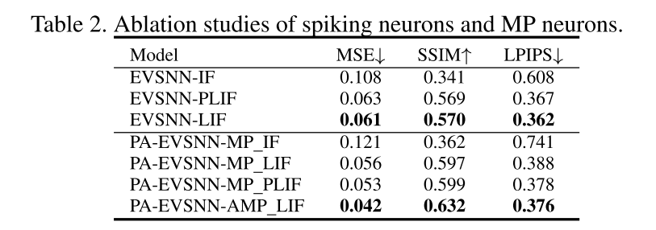

**膜电位神经元** 在 EVSNN-LIF 架构的基础上，我们进一步分析了 MP 神经元的效果。图 7 和图 8 显示，膜电位神经元可以提高 SNN 的重建质量： 我们测试了四种 MP 神经元：MP IF、MP LIF、MP PLIF 和 AMP LIF。这些神经元都是非尖峰神经元，它们输出的是膜电位而不是尖峰。PLIF 神经元可以根据训练数据集学习固定的膜时间常数。**然而，从合成数据中学到的固定膜时间常数可能并不适合复杂场景**。如表 2 下半部分所示，我们的 AMP LIF 性能最好，因为它可以根据输入尖峰自适应地调整衰减率。

> 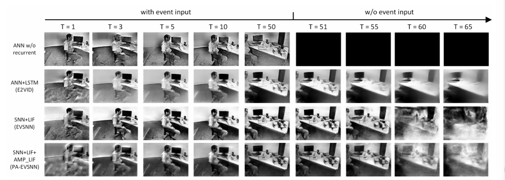
>
> 图7。SNN和ANN不同时间分量的比较。这张图显示了不同ANN和SNN变量在初始化和结束阶段的图像重建。在初始化阶段(T = 1-50)，将时间分量(如LSTM和尖峰神经元)的状态初始化为0，所有模型都输入连续事件张量来测试每个时刻的重构。在T = 50之后的后续迭代中，模型被输入空的事件张量来测试时间感受野的有效大小

> 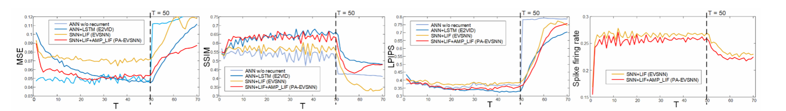
>
> 图8。时间成分的定量分析。该图显示了每次迭代的MSE、SSIM、LPIPS和spike触发率。实验设置与图7相同，测试4种ANN和SNN变体(ANN w/o recurrent, ANN + LSTM, SNN + LIF, SNN + LIF + AMP LIF)。结果表明，脉冲神经元可以提高时间信息的提取能力。

**尖峰跳接** 尖峰跳接收集编码器和解码器的尖峰输出。有效的连接操作可以大大提高 SNN 的性能。基于 EVSNN-LIF 和 PA-EVSNNAMP LIF 架构，我们研究了四种类型的尖峰连接。如表 3 所示，**ADD 性能最好，因为它通过添加编码层和解码层的尖峰来保留更多信息。但是，它带来了非尖峰输出，例如，增加两个尖峰将输出 2，这打破了完全 SNN 架构，并增加了额外的功耗**。相比之下，OR、IAND 和 CONCAT 都会输出尖峰。如表 3 所示，CONCAT 性能最好，而 IAND 性能也不错。虽然 CONCAT 的参数数是 IAND 的两倍，但为了获得更好的性能，我们在架构中选择了 CONCAT。

> 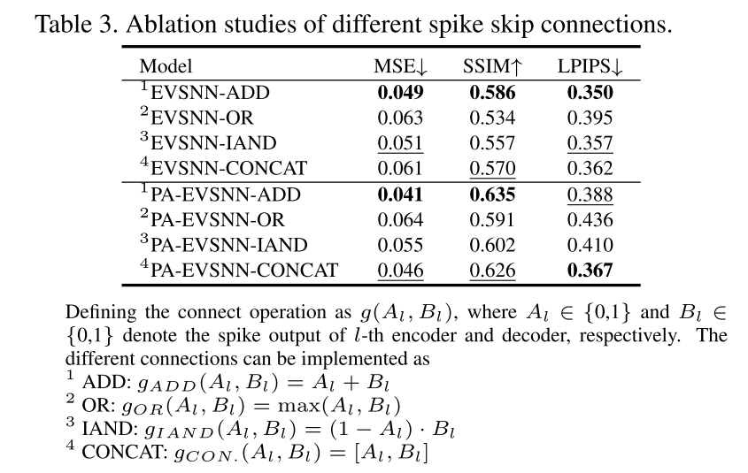

最后，我们搜索编码器和剩余块的数量。结果如表4所示，如EVSNN-e3-res1表示有三个编码器和一个残差块的EVSNN。考虑到性能和复杂度，我们选择EVSNN-e3-res1和PA-EVSNN-e3-res1作为我们的模型。

> 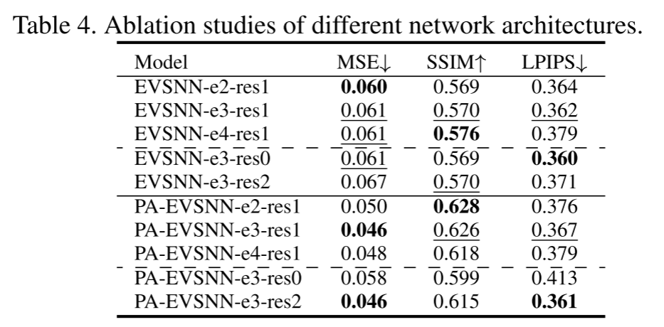

### 4.5能源消耗及局限性分析

**SNN和ANN的能量比较** 通常，突触操作的数量被用作对神经形态硬件[27]的计算能量进行基准测试的度量。在人工神经网络中，每个操作计算一个点积，包括一个浮点(FP)乘法和一个浮点加法，作为乘法累加(MAC)计算。相比之下，在神经形态硬件上实现的SNN的计算是事件驱动的。因此，在没有尖峰的情况下，[8]不需要计算，也不需要消耗有功能量。因此，在SNN中，由于双尖峰的存在，每个操作只是一次FP相加。SNN突触操作的低消耗与激活稀疏性相结合，极大地提高了计算效率

为了比较SNN和ANN架构的消耗，应该在相同的结构[39]上进行评估。因此，我们计算我们的SNN模型和它们的ANN版本之间的能量消耗(例如，用ReLU替换尖峰神经元)。在大多数技术中，加法运算比乘法运算要便宜得多。我们计算了45纳米CMOS技术中ann和snn的能量成本/操作。32位ANN MAC操作的能量消耗比SNN加法操作多5.1倍(4.6pJ比0.9pJ)[17]。

SNN中突触操作的数量可以通过#OPANN 1乘以脉冲放电率来计算。例如，峰值率为1(每个神经元被触发)意味着ANN和SNN的操作数量相同(尽管在ANN中操作是MAC，而在SNN中是加法)。较低的尖峰率表示尖峰事件的稀疏性和较高的能量效率。如表5所示，我们计算了IJRR数据集上EVSNN和PAEVSNN的平均脉冲放电率。对比结果如表6所示。注意，我们的模型不需要多时间步长模拟，这在能耗方面有很大的优势。对于EVSNN，所有操作均为SNN操作，平均尖峰放电率为26.4%，能耗比神经网络低19.36 ×。由于PA-EVSNN中有8.4%的mac操作，尖峰神经元的平均尖峰放电率为25.1%，与完全ANN版本相比，能耗降低了7.75倍。

> 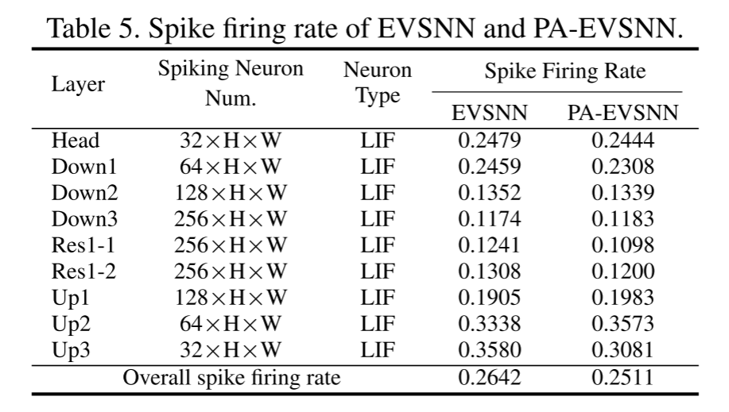
>
> 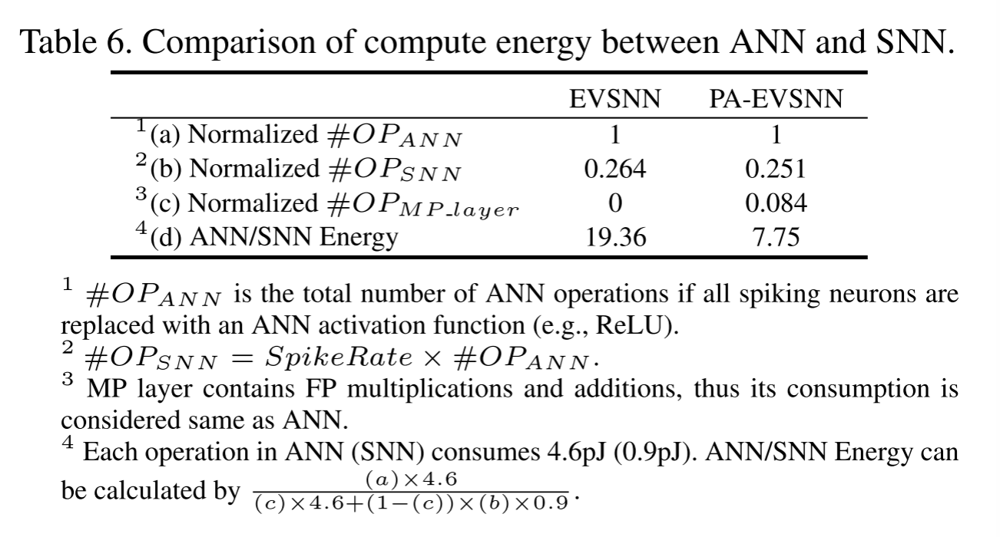

这里我们比较了我们的型号和E2VID的能耗。表7报告了与180×240输入大小的能量比较。ANN每次操作消耗4.6pJ，得到20.07G×4.6pJ = 9.232×10−2J的能量消耗。与LSTM相比，GRU是一个参数较少的循环模块。我们的EVSNN有16.12G SNN操作和26.4%的脉冲发射率，这需要16.12G×26.4%×0.9pJ = 3.83×10−3J。对于PA-EVSNN，我们将来自MP神经元的1.49G操作视为神经网络的运行。因此PA-EVSNN的总能量消耗为1.49G×4.6pJ+16.35G×25.1%×0.9pJ = 1.055×10−2J。综上所述，EVSNN和PAEVSNN的计算效率分别比E2VID高24.15 ×和8.76 ×。

为了使SNN训练更快、更稳定，我们在卷积(CONV)层之后增加了批处理归一化(BN)。注意，训练[45]后，BN可以在CONV层中折叠。然而，BN不是不偏不倚的。如果没有尖峰输入，BN也会产生非零值，这可能会激活尖峰神经元。这将增加SNN的峰值速率，从而增加能量消耗(见图8，无事件输入时的峰值速率> (T > 50))。降低峰值率可能是未来的一个方向。