# SPIKFORMER: WHEN SPIKING NEURAL NETWORK MEETS TRANSFORMER

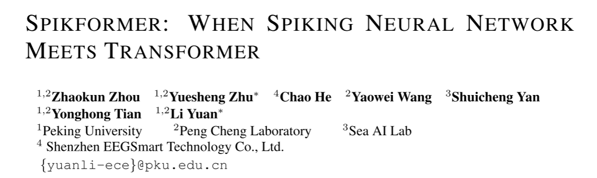

> 原文：<https://openreview.net/forum?id=frE4fUwz_h>

本文作者尝试将自注意力机制应用于SNN中，提出了一种新的注意力机制（Spiking Self Attention, SSA）和一个框架（Spiking Transformer , Spikformer）。Spikformer中的SSA机制使用脉冲形式的Query（Q）、Key（K）、Value（V），避免了乘法运算，并且不使用softmax来建模稀疏的视觉特征。结果表明，使用4个时间步对ImageNet分类可获得74.81%的top1精度。

作者提出了一种新的有效且计算效率高的自注意力变体SSA，可以避免乘法而通过逻辑与运算和加法来完成。在SSA中，Q、K和V都是脉冲形式，只包含0和1。由于（1）**由脉冲形式的Q和K计算出的注意图具有天然的非负性，忽略了不相关的特征。因此不需要softmax来保持注意矩阵的非负性**。（2） **SSA的输入和V为脉冲形式**，与ANN中VSA(Vanilla Self Attention)的浮点输入和V相比，**没有那么细粒度的特征。因此浮点Q和K以及softmax函数对于这种脉冲序列的建模是多余的**。基于上述观点，作者放弃了SSA中注意图的softmax归一化，并且SSA在弃用softmax后是可分解的。

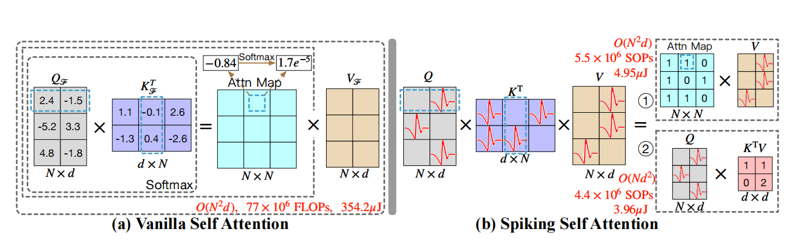

图1:vanilla自我注意(VSA)和spike自我注意(SSA)的说明。红色的尖刺表示该位置的值为1。蓝色虚线框提供了矩阵点积运算的示例。为了方便起见，我们选择SSA的其中一个头部，其中N为输入patches的数量，d为一个头部的特征维数。FLOPs是浮点运算，而sop是理论上的突触运算。由ImageNet测试集上8个编码块512嵌入维Spikformer (Kundu et al.， 2021b;Hu等人，2021a)。更详细的理论SOP和能耗计算在附录中。c.2。(a)在VSA中，QF、KF、VF是浮点形式。QF与KF点积后，softmax函数将注意图中的负值正则化为正值。(b)在SSA中，注意图中的所有值都是非负的，并且使用尖峰形式的Q、K、V (VSA中的$5.5×10^6$ VS. $77×10^6$)进行稀疏计算。因此，与VSA(354.2µJ)相比，SSA的计算消耗的能量更少。此外，SSA是可分解的(Q、K、V的计算顺序是可变的)。

## 3. 方法

### 3.1整体框架

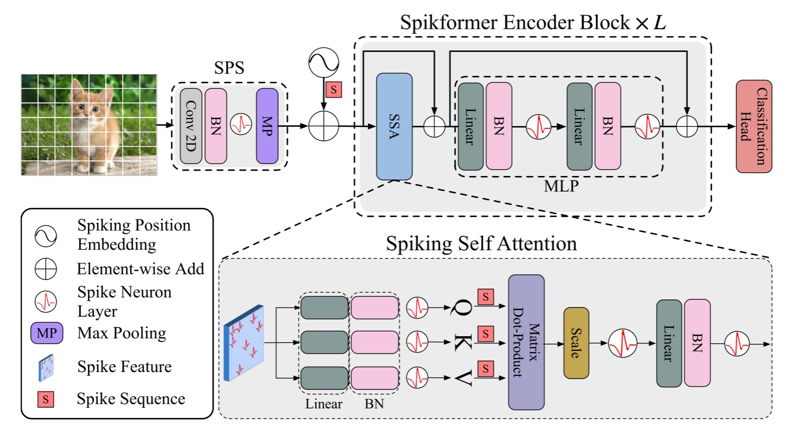

图2:Spikformer (Spikformer)的概述，它由一个Spikformer补丁分割模块(SPS)、一个Spikformer编码器和一个线性分类头组成。我们的经验发现，层归一化(LN)不适用于snn，因此我们使用批归一化(BN)代替。

图2描述了Spikformer的概述。给定一个二维图像序列$I∈R^{T×C×H×W}$[1], Spiking Patch Splitting (SPS)模块将其线性投影到一个D维的spike-form特征向量，并将其**分割为一个由n个扁平的spike-form Patch $x$组成的序列**。在snn中不能使用浮点形式的位置嵌入。**我们使用条件位置嵌入生成器(Chu et al.， 2021)生成spike-form relative position embedding** (RPE)，并将RPE添加到patch序列x中得到X0。**该条件位置嵌入发生器包含核大小为3的二维卷积层(Conv2d)、批归一化层(BN)和脉冲神经元层(SN)**。然后我们将X0传递给L块Spikformer编码器。与标准的ViT编码器块类似，**Spikformer编码器块由一个Spiking Self Attention (SSA)和一个MLP块组成。剩余连接同时应用于SSA和MLP块。**SSA作为Spikformer编码器块的主要组成部分，提供了一种不使用softmax，使用spike-form Query (Q)、Key (K)和Value (V)对图像的局部-全局信息进行建模的有效方法，将在第3.3节详细分析。对Spikformer编码器处理后的特征利用一个global average-pooling (GAP)输出d维特征，将d维特征发送给全连接层分类头(CH)输出预测y。

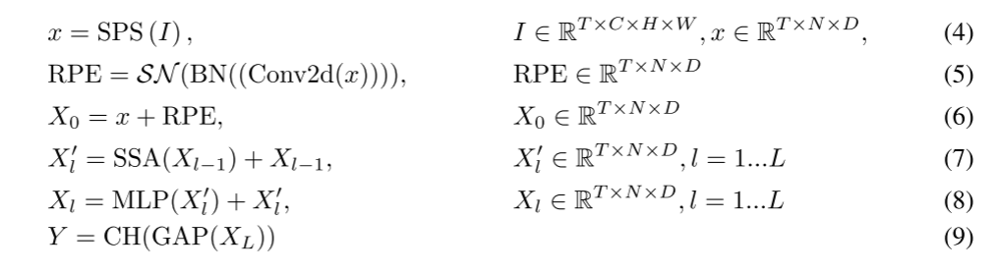

[1] 在神经形态数据集中，数据形状$I∈R^{T×C×H×W}$，其中T、C、H、W分别表示时间步长、通道、高度和宽度。静态数据集中的2D图像$I_s∈R^{C×H×W}$需要重复T次才能形成图像序列。

### 3.2 spike patch分裂

如图2所示，**Spiking Patch Splitting (SPS)模块的目标是将一幅图像线性投影到一个D维的spike-form feature上，并将feature分割成固定大小的patches**。SPS可以包含多个块。类似于Vision Transformer中的卷积骨干(Xiao et al.， 2021b;Hassani等人，2021)，我们在每个SPS块中应用一个卷积层，将电感偏差引入Spikformer。具体来说，给定图像序列$I∈R^{T×C×H×W}$:

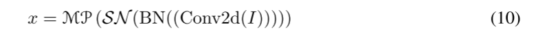

其中Conv2d和MP分别表示2D卷积层(stride- 1,3 × 3 kernel size)和max-pooling。SPS块的个数可以大于1。当使用多个SPS块时，这些卷积层中的输出通道数量逐渐增加，最终匹配patch的嵌入维数。例如，给定一个输出嵌入维D和一个四块SPS模块，四个卷积层的输出通道数为D/8、D/4、D/2、D。而采用2D-max-pooling层对固定大小的SPS块后的特征大小进行下样。经过SPS处理后，I被分割成一个图像patch序列$x∈R^{T×N×D}$。

> ViT:<https://zhuanlan.zhihu.com/p/662514510>
>
> ViT将输入图片分为多个**patch（16 \* 16）**,再将**每个patch投影为固定长度的向量**送入Transformer，**后续encoder的操作和原始Transformer中完全相同**。但是因为**对图像分类**，因此在输入序列中加入一个特殊的token，**该token对应的输出即为最后的类别预测**。
>
> 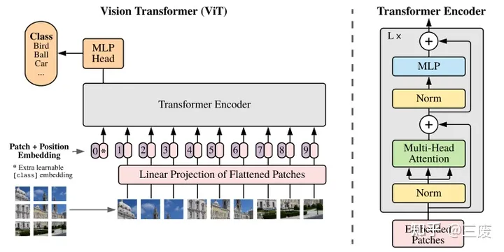
>
> （1）**patch embedding**：例如**输入图片大小为224x224**，将图片分为**固定大小的patch**，**patch大小为16x16**，每张图片**会生成224 \* \*224 / 16\* \* 16 = 196个patch**，即输入序列长度为**196**，每个patch维度16x16x3=**768**，线性投影层的维度为768 * N（N=768），因此输入通过线性投影层之后的维度依然为196 * 768，即一共有196个token，每个token的维度是768。这里还需要加上一个**特殊的字符cls**，因此最终的维度是**197 \* 768**。到目前为止，已经通过patch embedding将一个**视觉问题**转化为了一个**seq2seq**问题。
>
> （2）positional encoding ：ViT同样需要**加入位置编码**，位置编码**可以理解为一张表**，表**一共有N行，N的大小和输入序列长度相同（197）。**每一行代表一个向量，向量的维度和输入序列**embedding的维度相同（768）**。注意位置**编码的操作是sum**，而**不是concat**。加入**位置编码信息**之后，维度依然是**197x768。**
>
> （3）LN/multi-head attention/LN：LN（层归一化）输出维度依然是197x768。多头注意力时，先将输入映射到q，k，v，如果只有一个头，qkv的维度都是197 * 768，如果有12个头（768 / 12 = 64），则qkv的维度是197 * 64，一共有12组qkv，最后再将qkv的**输出拼接起来**，**输出的维度是197 \* 768** ，然后在**过一层LN**，维度**依然是197 \* 768。**
>
> （4）MLP：将**维度放大再缩回去**，197*768 放大为197*3072，再缩小变为197* 768
>
> 一个block之后**维度依然和输入相同**，都是197x768，因此可以**堆叠多个block**。最后会将**特殊字符cls**对应的输出$z^0_L$作为**encoder的最终输出** ，代表最终image presentation（另外一种做法是**不加cls字符**，**对所有的tokens的输出做一个平均**）如下图公式(4)，后面**接一个MLP**进行图片分类。

### 3.3尖峰自我注意机制

给定输入特征序列$X∈R^{T×N×D}$, ViT中的VSA有三个浮点关键组件，即query (QF)、key (KF)和value (VF)，它们是由可学习的线性矩阵$W_Q、W_K、W_V∈R^{D×D}$和X计算出来的:

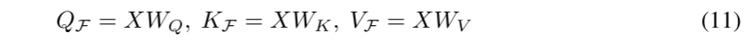

其中F表示浮点形式。vanilla自我注意的输出可以计算为:

其中d = d /H为一个头部的特征尺寸，H为头部数量。*将浮点形式的Value (VF)转换为spike形式的V，可以实现VSA在snn中的直接应用*，可以表示为:

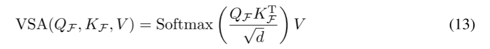

**但VSA的计算在snn中不适用，原因有二**。1) QF、KF和softmax函数的浮点矩阵乘法包含指数运算和除法运算，不符合snn的计算规则。2) VSA序列长度的空间和时间复杂度为二次型，不能满足网络节点的高效计算要求。

我们提出了Spiking Self-Attention (SSA)，它比VSA更适合snn，如图1(b)和图2底部所示。查询(Q)、键(K)和值(V)首先通过可学习矩阵计算。**然后它们通过不同的脉冲神经元层成为脉冲序列**:

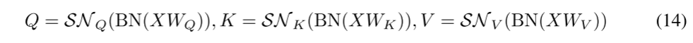

其中$Q,K,V∈R^{T×N×D}$。我们认为注意矩阵的计算过程应该使用纯尖峰形式的Query and Key(仅包含0和1)。受vanilla self-attention (Vaswani et al.， 2017)的启发，我们添加了一个缩放因子s来控制矩阵乘法结果的大值。s不影响SSA的性质。如图2所示，spike-friendly SSA定义为:

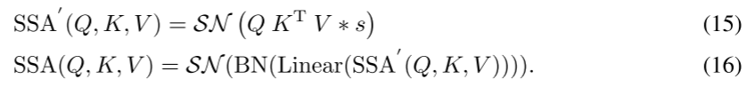

这里介绍的单头SSA可以很容易地扩展到多头SSA，详细情况见附录a。**SSA在每个时间步上独立进行**，详细情况见附录b。如式(15)所示，SSA取消了使用softmax对式(12)中的注意矩阵进行归一化，直接将Q、K和v相乘，直观的计算示例如图1(b)所示。在我们的SSA中，softmax是不必要的，它甚至阻碍了对snn的自我注意的实现。**形式上，根据Eq.(14)，由SNQ和SNk脉冲神经元层输出的脉冲序列Q和K自然是非负的(0或1)，从而得到一个非负注意图。SSA只聚合这些相关的特征，忽略不相关的信息。**因此，它不需要软max来确保注意图的非负性。而且，与网络中的浮点形式$X_F$和$V_F$相比，网络中的自我注意的**输入X和值V是spike形式的**，包含的信息有限。具有浮点形式QF、KF和softmax的普通自注意(VSA)对尖峰形式X, V建模是冗余的，它不能从X, V获得比SSA更多的信息。即SSA比VSA更适合snn。

我们通过将所提出的SSA与四种不同的注意地图计算方法进行比较，来验证上述观点，如表1所示。AI表示将浮点数Q与K直接相乘得到注意图，注意图既保持正相关，也保持负相关。AReLU利用ReLU(Q)和ReLU(K)的乘法得到注意图。AReLU保留Q、K的正值，负值设为0,ALeakyReLU保留负值。Asoftmax表示VSA之后生成注意图。以上四种方法使用相同的Spikformer框架，并对spike-form v进行加权。从表1可以看出，我们的ASSA优于AI和ALeakyReLU的性能证明了SN的优越性。ASSA优于AReLU的原因可能是ASSA在自我注意方面具有更好的非线性。与Asoftmax相比，ASSA更具竞争力，在CIFAR10DVS和CIFAR10上甚至超过了Asoftmax。这可能是因为SSA比VSA更适合信息有限的spike序列(X和V)。此外，ASSA完成Q、K、V计算所需的操作数和理论能耗也远低于其他方法。

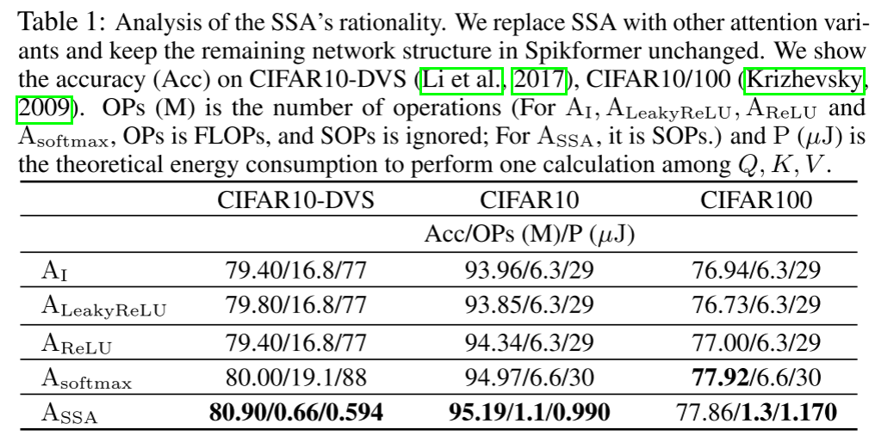

SSA是一种专门用于建模脉冲序列的算法。Q、K、V均为spike形式，将矩阵的点积计算退化为逻辑与运算和求和运算。我们以查询q的一行和键k的一列作为计算示例:$\sum^d_{i=1}q_ik_i=\sum_{qi=1}k_i$。此外，如表1所示，由于稀疏的尖峰形式Q、K、V(图4)和计算的简化，SSA的计算量和能耗较低。此外，Q、K、V的计算顺序是可变的:先$QK^T$后V，或先$K^TV$后Q。当序列长度N大于一个头的维度d时，第二次计算的计算复杂度($O(Nd^2)$)要小于第一次计算复杂度($O(N^2d)$)。SSA在整个计算过程中始终保持着生物合理性和计算效率。

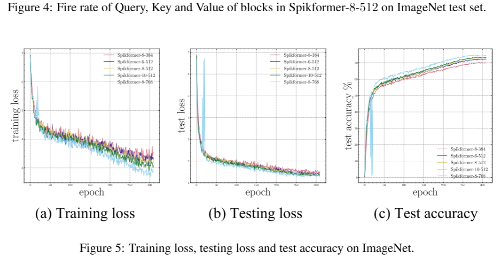

## 4 EXPERIMENTS