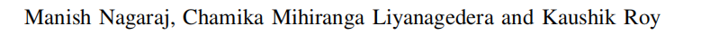
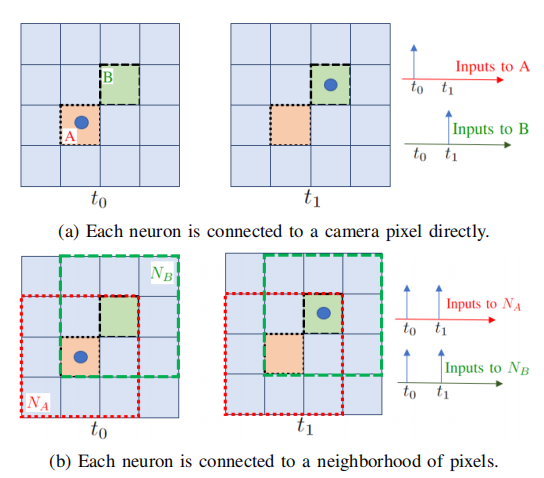
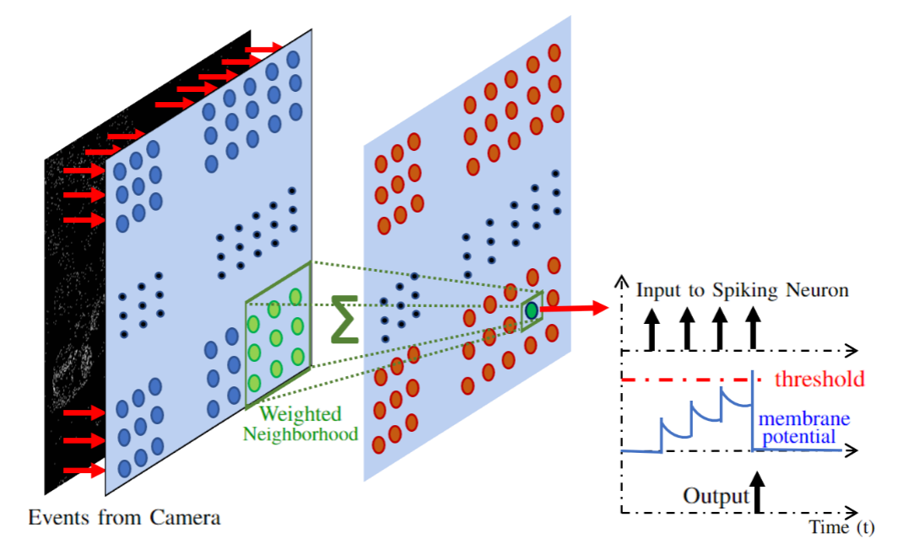
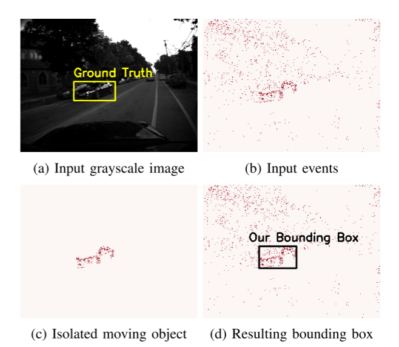
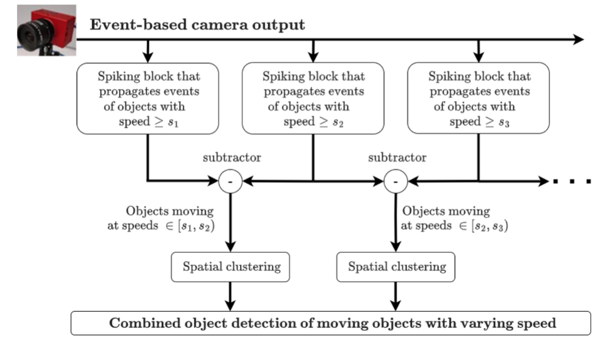
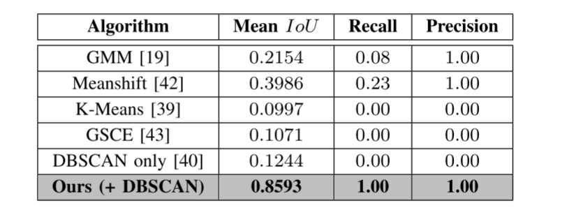
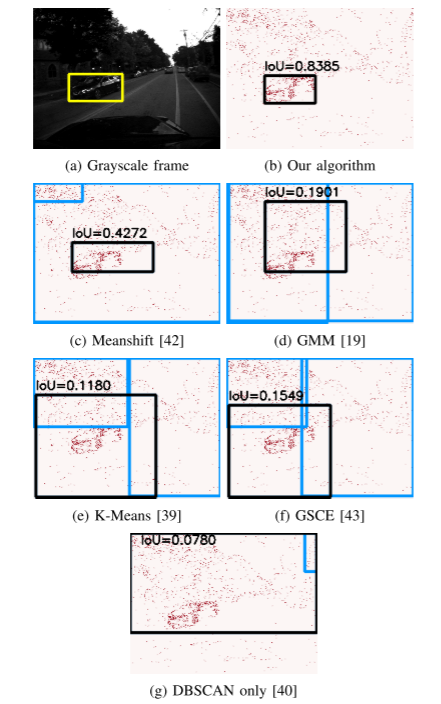
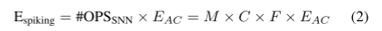
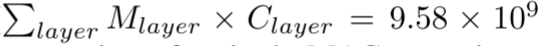

# DOTIE - Detecting Objects through Temporal Isolation of Events using a Spiking Architecture

> ICRA 2023:CCF-B 类
>
> 
>
> 摘要-- 基于视觉的自主导航系统依靠快速准确的目标检测算法来避开障碍物。由于用于部署的硬件能量有限，为这类系统设计的算法和传感器必须具有计算效率。受生物启发的事件相机因其速度快、能效高以及对不同光照条件的鲁棒性而成为此类系统视觉传感器的理想候选者。然而，传统的计算机视觉算法无法处理基于事件的输出，因为它们缺乏光度特征，如光照强度和纹理。**在这项工作中，我们提出了一种新技术，利用事件中固有的时间信息来高效检测移动物体。我们的技术由轻量级尖峰神经架构组成，能够根据相应物体的速度分离事件。然后对这些分离的事件进行进一步的空间分组，以确定物体边界。这种物体检测方法既是异步的，又对相机噪音具有鲁棒性。**此外，它在背景中静态物体产生事件的场景中表现出良好的性能，而现有的基于事件的算法在这种场景中会失效。我们的研究表明，利用我们的架构，自主导航系统在进行物体检测时可以将延迟和能量开销降到最低。
>
> `code`：<https://github.com/manishnagaraj/DOTIE>
>
> `pdf`:<https://pan.baidu.com/s/1VohS385lIc_u-KT3zsEDZg?pwd=nbo0>

## 方法

### A.分离时间域中的对象

**虽然将事件摄像机的每个像素直接连接到尖峰神经元可以测量该像素的输入频率，但并不一定能测量物体的速度。**

让我们考虑图 3 所示的情况。在这里，一个物体在时间步长 t0 时在像素 A 处产生了一个事件。如果该物体移动速度较快，则在下一个时间步长 t1 时，事件会在邻近的像素 B 处发生。

如果我们将每个像素连接到单个尖峰神经元，那么连接到像素 A 和 B 的神经元在每个时间步长内只能接收到一个输入（图 3a）。因此，该神经结构无法识别快速移动的物体。但是，如果我们**使用像素邻域的加权和作为神经元的输入（图 3b），那么连接到邻域 NA 和 NB（分别以像素 A 和 B 为中心）的神经元就会记录两个连续的输入。**这样，尖峰结构就能成功识别出快速移动的物体。

但是，如果使用一个非常大的邻域，就会导致空间上相距甚远的不同物体所对应的事件被注入同一个神经元，从而无法实现物体隔离。因此，选择一个合适的邻域大小至关重要。我们发现，邻域大小为（3 × 3）的效果最好。

图3:两个场景，事件在两个连续的时间步长中产生。在场景(a)中，事件在每个神经元上只被登记为一次输入。在场景(b)中，事件在两个神经元的两个时间步中都被注册。

因此，如图 4 所示，我们将像素的（3×3）加权邻域视为每个神经元的输入。中心像素的权重为 0.2，其余像素的权重均为 0.1。这使得我们的架构能够更高效地检测场景中的高速物体。

图 4：用于检测和分离属于高速移动物体的事件的尖峰结构。事件摄像机像素输入的加权和值直接输入神经元。如果物体移动速度较快，则会促使神经元产生尖峰输出。这可以用作一个检测门，只传播来自高速移动物体的事件，并过滤掉其余事件。

**一旦我们使用神经架构检测到快速移动的物体，我们就需要在空间域中分离出与这些物体相对应的输入事件**。为此，我们需要恢复尖峰输出邻域周围的输入。这种恢复邻域的大小可以调整，并不局限于神经元输入邻域的大小。我们的尖峰层将以一个时间步的延迟异步运行（**检查输出尖峰并恢复前一个时间步中导致该输出的输入**）。这种方法与许多现有方法不同，它不需要在一段时间内积累事件数据，然后才能用于处理。图 5 利用 MVSEC 数据集 [8] 中的一个场景演示了所提议的尖峰架构的运行。

图 5：在 MVSEC 数据集上演示我们的算法。与移动物体相对应的事件被分离出来，然后根据空间接近程度进行分组。

### B.空间域的聚类

**为了检测和绘制准确的目标边界，我们对分离的输入事件使用空间聚类。**虽然有许多广泛使用的聚类技术，但大多数都要求我们在聚类之前知道聚类的大小或数据中的聚类数量。因为我们没有任何输入场景的先验知识，所以我们需要一种独立于这两个因素的聚类技术。在我们的实验中，**我们选择了一种基于密度的技术，称为基于密度的空间聚类(DBSC)**[40]。这种技术需要的唯一参数是形成集群所需的最小数据点数量和集群的最小数据密度。这两个参数都经过了微调以获得最佳结果。

### C.扩展到多种速度

到目前为止，我们已经提出了一种尖峰神经块，**它可以将移动物体与静止物体区分开来**。虽然这很有用，而且已经显示出在真实世界场景中物体检测的改进，但我们还可以根据物体的速度进一步将其分离出来。图 6 显示了可用于根据速度分离物体的架构概览。

图 6：检测以不同速度移动的多个物体的架构概览。每个尖峰模块都根据特定的速度范围进行微调。与在此范围内以一定速度移动的物体相对应的事件会被传播。然后对这些输入事件进行空间聚类，以检测物体边界。

该架构的每个分支都将**隔离移动速度快于某个速度的物体**。通过考虑具有连续阈值速度 s1 和 s2 的分支输出之间的差值，**我们可以隔离出移动速度在 [s1, s2) 范围内的物体。在部署之前，我们可以根据应用情况添加和微调多个这样的范围**。这些分支并行运行，不会增加任何延迟。由于每个分支仅由单层尖峰神经元组成，因此系统的整体能效仍能保持不变。

## 实验

在本节中，我们将定性和定量地展示我们所提技术的准确性和能效。大多数现有作品都是在作者生成的私人数据集上评估其算法。**这些数据集不对公众开放，与现实生活中生成的事件摄像机输出结果也不相似。**

为了衡量我们的算法在实际场景中的准确性和能效，我们选择了 **MVSEC 数据集 [8] 来展示我们的结果**。这是一个公开可用的数据集，包含由安装在汽车上的事件摄像头和传统框架摄像头收集的数据。

### A.准确性

如前所述，大多数现有算法只能在没有任何背景或相机噪音的情况下运行。而我们的算法却能在这些条件下良好运行。这是因为，尖峰结构起到了时间过滤器的作用，既能消除来自摄像头的噪声输入，也能消除背景中静态物体产生的事件。

由于MVSEC数据集不包含前景中对象的真实边界框，我们使用YOLOv3[7]，这是一种传统的基于帧的现有技术算法，用于在相应的灰度图像上生成边界框。我们将其作为基本事实，然后比较前景中存在的对象（非静态）的并集交集（IoU）。由于灰度图像是以低得多的速率生成的，因此我们仅计算这些时间帧下基于事件的检测算法的IOU。然而，需要注意的是，我们的检测算法是异步的，并且可以以事件摄像机生成事件的速率进行操作。

我们将与ground truth相比 IoU ≥ 0.5 的边界框视为真阳性（TP），IoU < 0.5 的边界框视为假阴性（FN）。如果没有检测到相应的ground truth却生成了边界框，我们将其视为假阳性 (FP)。精确度和召回率是根据 TP、FN 和 FP 的标准定义计算得出的。表 I 显示了这些检测算法在 MVSEC 数据集第 2 天室外部分的准确度指标比较。

表一:表显示了现有目标检测算法与我们算法的精度指标的比较。实验选取MVSEC数据集的户外第2天段进行。

图 7 显示了这些算法预测的边界框的定性比较。我们发现，直接在事件摄像机输出上使用聚类技术（[39], [40]）无法准确检测到物体。这是因为，背景和摄像机噪声产生的事件可能与前景（或移动物体）产生的事件在空间上接近。其他技术，如 [42] 和 [19] 能够最大限度地减少误报的数量，但性能较差，会产生大量的误报（IoU < 0.5 的方框）。即使前景中只有一个物体，这些算法也会生成多个边界框。在数据集的所有实例中，我们的算法都优于所有其他现有算法，并且在生成具有良好 IoU（≥ 0.5）的边界框的同时，最大限度地减少了假阳性和假阴性的数量。为了进行更公平的比较，我们在计算生成多个边界框的算法的准确度指标时，会考虑相对于地面实况具有最高 IoU 的边界框。

图 7：我们的物体检测算法与现有算法的比较。在生成多个边界框的算法中，相对于ground truth而言，IoU 最高的边界框被认为是最合适的。这些边界框以黑色标出，其他边界框以蓝色标出2。

### B.计算效率

所提出的物体检测方法的主要优势之一是在能量和延迟方面的计算效率。尖峰神经元在膜电位中累积输入，只有当累积的膜电位超过设定的阈值时才会发出输出尖峰。与人工神经网络中使用的传统乘法和累加（MAC）运算相比，这些累加（AC）运算只需要计算所需能量的一小部分。文献 [12] 显示，在 45 纳米 CMOS 技术上进行 32 位浮点运算时，交流运算 (EAC) 的能耗为 0.9pJ，而 MAC 运算 (EMAC) 的能耗为 4.6pJ。此外，由于事件的性质，这些交流操作以稀疏的方式进行。

我们可以用 EAC 乘以这种突触操作 #OPSSNN 的次数，来估算尖峰层计算所消耗的能量。形式上，总计算能量为

其中，M 是尖峰神经元的数量，C 是突触连接（每个神经元的输入）的数量，F 是尖峰前的平均输入率。通过插入适当的值（M = 260 × 346，C = 3 × 3，F = 0.0151），我们估计我们的架构在 MVSEC 第 2 天室外赛段的推理过程中平均消耗 11.03nJ 的能量。与标准人工神经网络 YOLOv3 [7]在同一数据集上进行推理时消耗的 44.06mJ 平均能量相比，能耗大幅降低。我们将整个网络中的 MAC 操作数（)与单次 MAC 操作的能耗相乘，估算出后者的值。

我们提出的技术在延迟方面也是有效的。当传统的计算机视觉工作如[7]受到帧摄像机输入速率的限制时，由于事件摄像机的高输出速率，我们的算法可以以更快的速率运行。与许多基于事件的检测算法[20]、[23]、[24]不同，我们也不需要在处理之前累积一段时间的事件。算法真正的异步特性使我们在延迟方面的处理开销最小化。