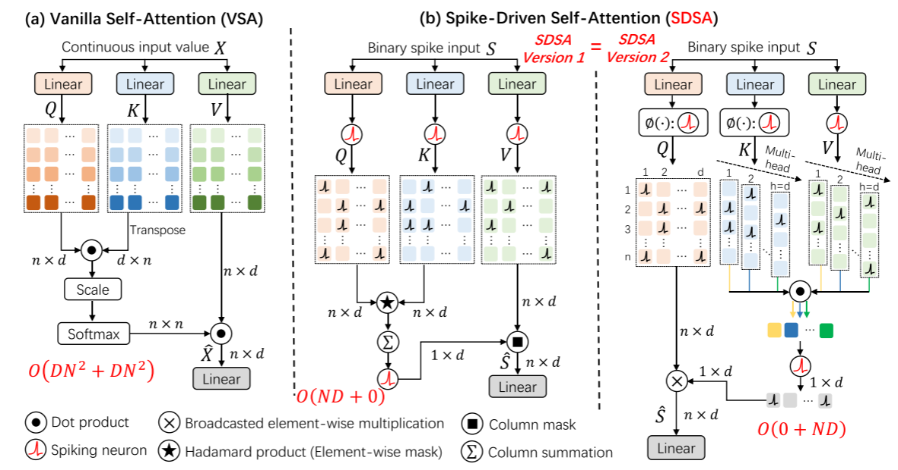

# Spike-driven Transformer

> 

近期的一项工作，SpikFormer [2]，展示了在 spiking self-attention 中，softmax 操作是可以去掉的。然而，SpikFormer 中保留了 spiking self-attention 中的 scale 操作。原因在于，脉冲形式 Q，K，V 矩阵之间运算会导致输出中会包含一些数值较大的整数，为避免梯度消失，SpikFormer 保留了 scale 操作（乘法）。

另一方面，SpikFormer 采用 Spike-Element-Wise（SEW）[3] 的残差连接，也就是，在不同层的脉冲神经元输出之间建立 shortcut。这导致与权重矩阵进行乘法操作的脉冲张量实际上是多 bit 脉冲（整数）。因此，严格来说，SpikFormer是一种整数驱动 Transformer（Integer-driven Transformer），而不是脉冲驱动 Transformer。

本文提出了 Spike-driven Transformer，如下图所示，以 SpikFormer [2] 中的模型为基础，做出两点关键改进：

- 提出一种脉冲驱动自注意力（SDSA）算子。目前 SNN 领域中仅有 Spike-driven Conv 和 spike-driven MLP两类算子。**本文所提出的 Spike-driven Self-attention 算子，为 SNN 领域提供了一类新算子。**

> 
>
> 图1:比较Vanilla自我注意(VSA)和spike驱动的自我注意(SDSA)(a)是典型的Vanilla Self-Attention (VSA)[8]。(b)为SDSA的两个等价版本。SDSA的输入为双尖峰。在SDSA中，只有掩模和稀疏添加。版本1:Spike Q和K首先执行元素式掩模，即Hadamard乘积;然后采用列求和法和spike神经元层法得到二元注意向量;最后，将二值注意向量应用于脉冲V上，以屏蔽部分通道(特征)。版本2:版本1的一个等价版本(见章节3.3)揭示了SDSA是一种独特类型的线性注意(峰值神经元层是核函数)，它的时间复杂度与token和通道维数都是线性的。通常，在VSA和SDSA中执行自我注意需要分别进行$2N^2D$乘累加和0.02累积操作，其中N为token数，D为通道维数，0.02为Q和K掩模后矩阵的非零比值，因此，spike Q, K，而V几乎不消耗能源。

- 调整 shortcut。将网络中的 SEW 全部调整为 Membrane Shortcut（MS）[4,5]，也就是在不同层的脉冲神经元膜电势之间建立残差连接。

> 
>
> 图2:尖峰驱动变压器的概述。我们遵循[20]中的网络结构，但做了两个新的关键设计。首先，我们提出了一个spike驱动的自我注意(SDSA)模块，该模块只包含掩模和稀疏加法操作(图1(b))。其次，我们重新设计了整个网络的捷径，包括位置嵌入、自我关注和MLP部分。如图所示，捷径是在spike神经元层之前构造的。即，我们在膜电位之间建立剩余连接，以确保脉冲矩阵中的值都是二进制的，这使得脉冲矩阵和权值矩阵的乘法可以转换为加法运算。相比之下，前人的研究[20,19]构建了不同层次的尖峰张量之间的捷径，使得尖峰神经元输出为多位(整数)尖峰。

> [20] Zhaokun Zhou, Yuesheng Zhu, Chao He, Yaowei Wang, Shuicheng Yan, Yonghong Tian, and Li Yuan. Spikformer: When spiking neural network meets transformer. In The Eleventh International Conference on Learning Representations, 2023.

## 3 Spike-driven Transformer

我们提出了一个spike驱动的Transformer，它将Transformer整合到只有稀疏添加的spike驱动范例中。我们首先简要介绍spike神经元层，然后逐个介绍spike驱动Transformer的概述和组成部分。尖峰神经元模型是生物神经元模型的简化模型[66,30]。本研究采用了具有生物神经元动力学特性且易于计算机模拟的Leaky integral - and- fire (LIF)脉冲神经元[1]。LIF层[36]的动态特性由

其中t表示时间步长，U[t]表示空间输入信息X[t]与时间输入H[t−1]耦合产生的膜电位，其中X[t]可通过Conv、MLP、self-attention等算子求得。当膜电位超过阈值uth时，神经元就会发出脉冲，否则就不会。因此，空间输出张量S[t]只包含1或0。Hea(·)是当x≥0时满足Hea(x) = 1，否则Hea(x) = 0的Heaviside阶跃函数。H[t]为时间输出，其中Vreset为激活输出峰值后设置的复位电位。β < 1为衰减因子，当脉冲神经元不放电时，膜电位U[t]衰减至H[t]。

### 3.1 整体架构

图2所示为spike-driven transformer的概述，它包括四个部分:spike Patch Splitting (SPS)、SDSA、MLP和一个线性分类头。对于SPS部分，我们遵循[20]中的设计。给定二维图像序列I∈RT×C×H×W, Patch Splitting Module (PSM)，即前四个Conv层，线性投影并分割为N个具有D维通道的平顶spike patches s序列，其中T(图像在静态数据集中重复T次作为输入)，C, H, W表示时间步长，通道，二维图像序列的高度和宽度。然后使用另一个Conv层生成相对位置嵌入(RPE)。合起来，SPS部分写为:

式中，**u和$U_0$分别为PSM和SPS的输出膜电位张量，SN(·)为spike神经元层**。然后我们将U0传递给$I$块spike驱动的Transformer编码器，该编码器由SDSA和MLP块组成。**残差连接应用于SDSA和MLP块的膜电位。SDSA提供了一种有效的方法，利用不需要缩放和softmax的spike Q、K和V对图像的局部-全局信息进行建模(见第3.3节)**。在spike驱动编码器处理后的特征上利用一个Global Average-Pooling (GAP)输出d维通道，该通道将被发送到全连接层分类头(CH)输出预测y。SDSA、MLP和CH三部分可写如下:

式中，$U' _l$和$S '_l$表示SDSA在第l层输出的膜电位和峰张量。

### 3.2 尖峰驱动transformer中的膜捷径

残差连接 [67, 68] 是 Transformer 架构中一个重要的基本操作。现有的基于 Conv 的 SNN 有三种捷径技术[27]。Vanilla Res-SNN [38] 类似于 vanilla Res-CNN [67]，在膜电位和尖峰之间执行捷径。Spike-Element-Wise (SEW) Res-SNN [25] 采用捷径连接不同层的输出尖峰。膜捷径（MS）Res-SNN [26]，在各层尖峰神经元的膜电位之间建立捷径。目前 SNN 界还没有统一标准的捷径，现有的尖峰变换器采用的是 SEW 捷径 [20，12]。如式 7、式 9 和式 11 所示，我们在提议的尖峰驱动transformer中利用膜捷径有四个原因：

- spike驱动是指将权值和spike张量之间的矩阵乘法转换为稀疏加法的能力。只有双尖峰才能支持尖峰驱动功能。然而，尖峰张量中的值是多位(整数)尖峰，因为SEW捷径是在二进制尖峰之间建立加法。而如Eq. 8, Eq. 10, Eq. 11所示，SN后面是MS捷径，保证了spike张量中始终只有二进制spike信号。
- 高性能。MS-Res-SNN的任务精度高于SEW-Res-SNN[26,27,25]，同样在基于transformer的SNN中(见本文的表6)。
- 生物合理性。MS捷径可以理解为一种优化膜电位分布的方法。这与其他神经科学启发的优化snn内部动态的方法是一致的，如复杂的spike神经元设计[69]、注意机制[27]、长短时记忆[34]、循环连接[70]、信息最大化[71]等。
- 动态等距。MS-Res-SNN已证明[26]满足动态等距理论[72]，这是对行为良好的深度神经网络的理论解释[73,74]。

### 3.3 spike驱动的自我关注

**尖刺驱动的自我注意(SDSA)版本1。**

如图2(b)左部分所示，给定spike输入特征序列$S∈R^{T×N×D}, R^{T×N×D}$中的浮点Q、K和V分别由三个可学习的线性矩阵计算。注意，这里的线性运算只是加法，因为输入S是一个脉冲张量。将Q、K、V转换为脉冲张量$Q_S、K_S和V_S$. SDSA Version 1 (SDSA- v1)表示为:

其中⊗为Hadamard乘积，g(·)用于计算注意力图，SUMc(·)表示各列之和。g(·)和SUMc(·)的输出都是d维行向量。**spike张量之间的Hadamard乘积等价于mask运算。**

**关于SDSA的讨论**

由于$R^{N×D}$中$Q_S、K_S、V_S$之间的Hadamard乘积(为了数学理解，这里假设T = 1)是可以交换的，所以Eq. 13也可以写成:

由此可见，式14是一个线性注意[23,62]，由于KS和VS可以先参与计算，其计算复杂度在token数N上是线性的。这是由于在这里删除了VSA中的softmax操作。softmax的功能需要替换为内核功能。对于我们的SDSA, SN(·)是内核函数。进一步，我们可以假设一个特殊情况[61]，H = D，即每个头的通道数为1。分别对H头进行自注意操作后，将输出串接在一起。具体来说，

其中$R^{N×1}$中的$Q^i、K^i、V^i$分别是Q、K、V中的第i个向量，⊙是点积运算。$g(K^i, V^i)$的输出是一个标量，0或1。由于SN(Qi)与g(Ki, Vi)之间的运算为掩模，因此整个SDSA只需要对g(Ki, Vi)计算H = D次，SDSA的计算复杂度为O(0 +ND)，与N和D都是线性的(见图1(b)右侧部分)。向量Ki和Vi非常稀疏，一般小于0.01(表2)。加起来，整个SDSA只需要大约0.02次的添加，其能量消耗可以忽略不计。

有趣的是，Eq. 14实际上将soft vanilla self-attention转换为hard self-attention，其中软注意和硬注意的注意得分分别为连续值和二元值[75]。因此，本研究中尖峰驱动范式的实践利用了二元自我注意分数，直接掩盖稀疏尖峰值张量中不重要的通道。虽然这导致了精度的轻微损失(表6)，但SDSA(·)几乎不消耗能量。

