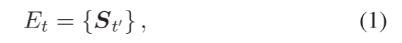
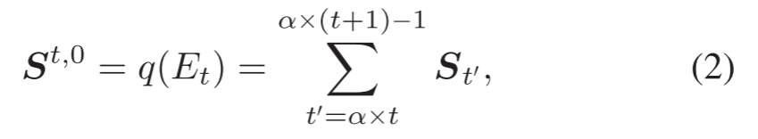

# Attention Spiking Neural Networks

> 摘要:脑激发的尖峰神经网络(snn)正成为传统人工神经网络(ann)的一种有前途的节能替代方案。然而，snn和ann之间的性能差距已经成为广泛部署snn的一个重大障碍。为了充分发挥snn的潜力，本文研究了人们关注重要信息的注意机制。在snn中，我们提出了一个多维的注意力模块，它分别或同时沿时间、通道和空间维度推断注意力权重。在现有神经科学理论的基础上，我们利用注意权重来优化膜电位，进而调节脉冲反应。基于事件的动作识别和图像分类数据集的大量实验结果表明，注意力有助于普通snn实现更稀疏的尖峰触发，更好的性能和能量效率。特别是，单步/四步Res-SNN-104在ImageNet-1 K上的准确率分别达到75.92%和77.08%，这是目前snn中最先进的结果。与同类Res-ANN-104相比，性能差距为-0.95/+ 0.21%，能效为31.8×/7.4×。为了分析注意snn的有效性，我们从理论上证明了在一般snn中存在的尖峰退化或梯度消失可以通过引入块动态等距理论来解决。在此基础上，分析了注意力网络的效率。我们的工作点亮了SNN作为支持SNN研究领域各种应用的一般支柱的潜力，并在有效性和能源效率之间取得了良好的平衡

## I. INTRODUCTION

人类能够自然而有效地在复杂场景中找到显著区域。基于这一观察结果，注意力机制已被引入深度学习，并在广泛的应用领域取得了显著的成功。当前深度学习中的注意力普遍存在两种方式。**一个是在执行元操作符的方式上提出了根本性的范式转变，例如使用自我注意行为Transformer[15]**。最近，除了NLP中的经典应用之外，Transformer结构在CV中隆重登场，并以其在各种任务[16]、[17]、[18]中炫目的性能迅速掀起了一股纯粹关注架构设计的浪潮。另一种则倾向于集成现有的经典深度神经网络作为辅助再校准模块，以增加基本模型的表示能力，如注意卷积神经网络(attention convolutional neural network, attention cnn)[19]。上面的两个注意实践也可以结合在一起，例如使用attention作为Transformer的一个独立辅助模块，以专注于提供信息的特性或补丁[20]。

相比之下，注意力在SNN领域的应用仍有待开发。现有的作品很少，与前面提到的传统深度学习中的注意实践完全不同。他们专注于使用SNN来模拟注意机制[21]、[22]或通过注意[23]执行SNN模型压缩。我们并不打算改变现有SNN的元算子，例如，用自我注意替换卷积，而是尝试将注意力作为一个辅助单元，方便地与现有SNN架构集成，以提高表示能力，比如注意力cnn。在snn中适应注意力的挑战有三个方面。首先，我们必须保持SNN的神经形态计算性质，这是SNN能量效率的基础。因此，在保持SNN的事件驱动的同时实现注意力是首要考虑的问题。其次，snn用于处理各种应用程序，如顺序事件流和静态图像。我们需要对SNN设计进行多样化的注意力，以应对不同的场景。第三，二元尖峰活性使深度snn出现尖峰退化[13]和梯度消失[12]，统称退化问题，即当网络深化时，训练集和测试集的准确率都会下降。注意力不应使情况变得更糟。

在视觉神经科学中，注意通过调节嘈杂的感觉环境[24]中的突触权重和神经元尖峰活动率来增强神经元的沟通效能。为了模拟大脑中的注意力，我们利用注意力来促进尖峰神经元的膜电位的优化，这相当于突触改变，不会破坏snn的事件驱动性质。我们的设计理念是明确的，利用注意力来调节膜电位，即关注重要的特征，抑制不必要的特征，进而影响尖峰活性。相反，在cnn[19]中，注意力被用于细化激活。潜在的原因是，cnn中的神经元通过连续的激活来相互通信，而不是像大脑一样的尖峰激活。**为了使注意力SNN适应不同的应用场景，我们将多维注意力与SNN (MA-SNN)融合，包括时间、通道和空间维度，分别学习“何时”、“什么”和“哪里”。**根据特定的任务度量需求(如延迟、准确性和能量成本)，可以单独或同时利用这些注意力维度。采用经典卷积块注意模块(CBAM)[25]作为构建MA-SNN的基本模块。此外，设计了注意残差snn来处理大规模的ImageNet1 K。我们利用MS-Res-SNN[12]作为骨干，因为它具有较高的准确性和快捷的连接方式。我们认为MS-Res-SNN中的膜捷径与我们引入注意的动机是一致的，这也可以被视为一种优化膜电位的方法。

ma - snn的优点有三个方面。首先，通过模拟大脑中的注意力，我们提出了MA-SNN。各种任务的大量实验结果表明，通过关注优化膜电位可以导致更稀疏的脉冲响应，同时带来更好的性能和能源效率。例如，在基于事件的dvs128 Gesture[26]/步态[27]数据集上，轻量级普通snn上的spike计数减少了84.9%/81.6%，任务精度和能量效率分别提高了5.9%/4.7%和3.4×/3.2×。其次，我们揭示了MA-SNN的注意机制。我们回答了一个关键的问题:如何在MA-SNN中同时实现效率和能源效率。为了解决这一问题，提出了一种新的峰值响应可视化方法来观察注意优化的膜电位对峰值响应的影响。我们证明了MA-SNN的有效性主要来自于适当的聚焦，就像之前的CNN工作[19]，[28]，[29]，[30]一样。在效率方面，MA自适应抑制背景噪声的膜电位，使这些尖峰神经元不被激活。基于这一观点，我们可以解释为什么在关注snn中可以实现更低的峰值活动率，并具有更高的能源效率。第三，我们证明了在一般深度snn中存在的降解问题可以通过增加对MS-Res-SNN(即Att-Res-SNN)的关注得到解决。具体来说，我们通过引入块动态等距理论，证明了在我们的注意残差学习中可以实现梯度范数等式[31]，这意味着我们可以像MS-ResSNN一样训练非常深入的at - res - snn。我们的贡献总结如下:

- 多维注意SNN:我们提出了我们的注意SNN思想，它融合了多维注意，并继承了事件驱动的SNN本质。在多个基准上验证了MA-SNN的稀疏峰值活动、性能和能量效率。
- 注意力的理解和可视化:我们提出了一种峰值反应可视化方法来解释为什么在snn中注意力的有效性和效率可以同时实现。
- Att-Res-SNN的梯度范数等式:基于块动态等距理论，证明了Att-ResSNN的梯度范数等式[31]是可行的。

## II. RELATED WORK

神经网络的训练方法:神经网络到神经网络的转换和直接训练神经网络是深度神经网络训练的两种主要方法。ANN到SNN的基本思想是，在速率编码方案下，基于relu的ANN的激活值可以近似于SNN的平均发射速率。在ann到snn的方法中存在准确性和延迟的权衡问题，需要足够的时间步长来进行速率编码，以减轻近似误差[32]。虽然转换后的SNN与ANN在一些大规模结构中，如VGG和ResNet[33]、[34]、[35]可以获得最小的精度差距，但它们需要较长的时间步长或复杂的训练方法，这增加了SNN的延迟，限制了实际应用。直接训练SNN是SNN的另一种训练模式，它构成了对非光滑尖峰的连续松弛，从而使用替代梯度[36]进行反向传播。与ANN-to-SNN相比，它在时间步长的数量上有很大的优势，也可以应用于时态任务，如基于事件的数据集。直接训练算法在编码方案的选择上存在差异，如时间编码和速率编码[37]。时间编码限制了网络的规模，本文采用速率编码直接训练的方法获取大规模的snn。

基于事件的视觉:动态视觉传感器(Dynamic Vision sensor, DVS)将每个像素亮度变化的时间、位置和极性编码为μs级时间分辨率的事件流，为视觉信息获取带来了新的范式转变。与传统摄像机相比，分布式摄像机具有[38]的优点:只在强度变化时触发事件，所需资源少;高时间分辨率，避免运动模糊;一个非常高的动态范围，这使得分布式交换机能够从挑战性的照明条件中获取信息。这些特性促进了分布式交换机在各种场景中的应用，如高速对象跟踪[39]、低延迟交互[26]等。逐个处理事件仅限于性能，因为单个事件几乎没有信息。一般的方法是将事件流与特定的时间窗口进行分组，例如，基于帧的[40]，基于图的[41]，等等。在本文中，我们采用基于帧的表示方法，将事件流转换成高速率的视频，其中每帧有许多空白(零)区域。SNN适用于处理事件帧，因为它可以跳过对每个输入[6]的零区域的计算。

CNN中的关注:深度、宽度和基数是CNN架构设计中获得丰富表现力的三个重要因素。除了这些因素，关注是架构设计的另一个不同方面，它通过关注重要信息来增加表示能力。它的意义在以往的文献中得到了广泛的研究。Hu等人[19]在cnn中率先提出了注意模块，首先提出了channel attention的概念，并为此提出了SENet。由于不同的通道通常代表不同的对象，SENet对通道之间的关系进行建模，自适应地细化每个通道的权重，即决定关注什么。由于卷积运算是通过将跨通道和空间信息混合在一起来提取信息特征的，Woo等人[25]提出了CBAM，该CBAM顺序地应用通道和空间注意模块，并发地确定注意什么和在哪里。对于信道的建模和空间关注有很多方面的优化，如有效性[42]、空间复杂度[30]、计算复杂度[43]等。请参阅[44]的CV中关于注意事项的全面回顾。

## III. MULTI-DIMENSIONAL ATTENTION SPIKING NEURAL NETWORKS

在本节中，我们将在第 III-A 节和第 III-B 节中分别介绍网络输入预处理和基于 Conv 的 SNN。然后，我们将在第 III-C 节中设计 MA 模块，分别学习时间注意力（何时）、通道注意力（什么）和空间注意力（在哪里）。最后，我们将在第 III-D 节中介绍针对 SNN 的注意力残差学习设计。

### A. Network Input

基于事件的流:我们采用基于帧的表示作为预处理方法，将事件流转换成高速率的帧序列，其中每一帧都有很多的零区域。事件流包含四个维度:两个空间坐标(x, y)、时间戳和每个单个事件的极性。极性p表示亮度的增加(ON)或减少(OFF)，其中ON/OFF可以通过+1/-1值表示。假设事件流的初始时间分辨率为dt (μs级)，空间分辨率为h0×w0, spike pattern张量St∈R2×h0×w0等于时间戳t处事件集Et = {ei|ei =[xi,yi,t,pi]}。我们可以设置一个新的毫秒级的时间分辨率dt = dt × α，连续的α峰模式可以被分组为一个集合

其中t∈[α × t， α × (t +1)−1]。然后，可以得到t时刻St,0∈R2×h0×w0基于dt的输入层的帧

其中t∈{1,2，…，T}为时间步长，q(·)为逐元素加法函数。通过这种方式，事件流可以转换成具有新的帧率的实值帧序列，例如，dt = 1 ~ ms对应于每秒103帧。图7是一个事件帧的例子。

静态图像:对于图像中像素强度的模拟值信号，增加编码层生成全局尖峰信号是SNN[45]的一种通用方法。由于SNN是一种时空模型，在T> 1，即S1,0 = S2,0 =···= ST,0的每个时间步上复制图像作为输入帧。
