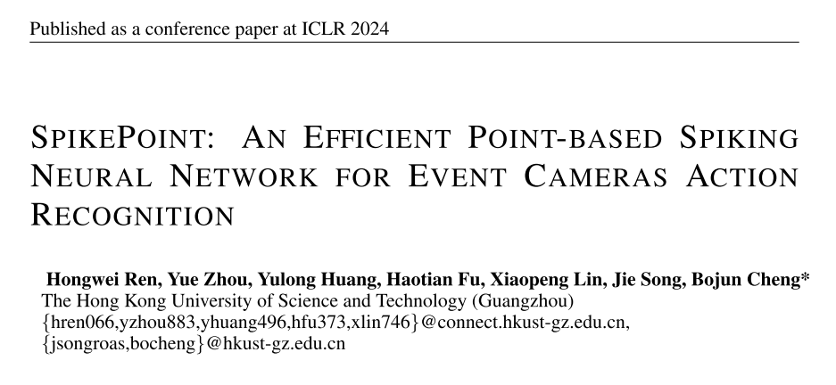
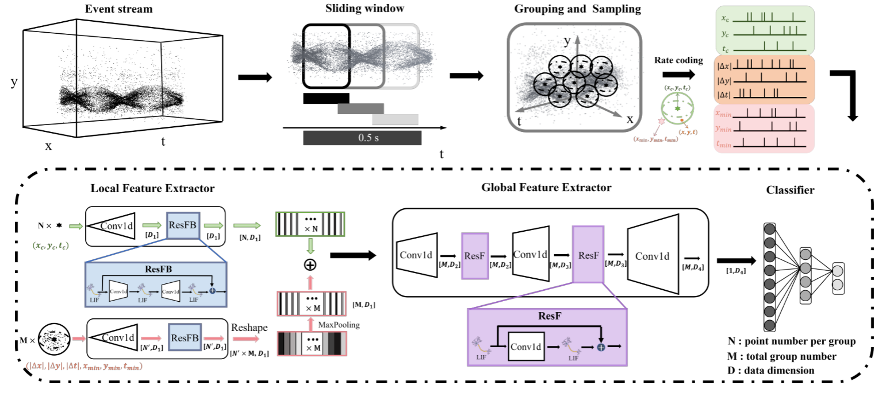

# Spikepoint:用于事件相机动作识别的高效的基于点的脉冲神经网络

事件相机是一种受生物启发的传感器，可响应局部光强变化，具有低延迟、高能效和高动态范围的特点。与此同时，脉冲神经网络(SNNs)因其卓越的效率和容错性而备受关注。通过协同利用事件相机固有的能源效率和snn基于峰值的处理能力，它们的集成可以实现超低功耗的应用场景，例如动作识别任务。然而，现有的方法通常需要将异步事件转换为常规帧，导致额外的数据映射工作和稀疏性的损失，与snn和事件相机的设计概念相矛盾。为了应对这一挑战，我们提出了SpikePoint，一种新颖的端到端基于点的SNN架构。SpikePoint擅长处理稀疏事件云数据，通过单阶段结构有效地提取全局和局部特征。利用代理训练方法，SpikePoint在不同的数据集上使用身份映射特征提取器，实现了以较少的参数实现高精度和低功耗的目标。SpikePoint在5个基于事件的动作识别数据集上实现了最先进的(SOTA)性能，仅使用16个时间步长，超过了其他SNN方法。此外，它还在三个数据集上实现了所有方法的SOTA性能，使用了大约0.3%的参数和0.5%的人工神经网络(ann)功耗。这些结果强调了点云的重要性，并为许多超低功耗基于事件的数据处理应用铺平了道路。

## 1 INTRODUCTION

事件相机是计算机视觉领域的最新发展，它正在彻底改变视觉信息的捕获和处理方式(Gallego et al.， 2020)。它们特别适合检测快速移动的物体，因为它们可以消除冗余信息，并显着减少内存使用和数据处理要求。这是通过创新的像素设计实现的，导致比传统相机更高效的稀疏数据输出(Posch et al.， 2010;Son等人，2017)。然而，大多数事件数据处理算法依赖于复杂的深度人工神经网络，这与事件相机的低功耗优势不一致。相反，将基于事件的视觉任务与snn相结合，由于其高度兼容的特性，特别是在动作识别等任务中，显示出了巨大的潜力(Liu et al.， 2021a)。

脉冲神经网络作为一种很有前途的替代方案已经出现，它可以解决传统神经网络的局限性，因为它们具有卓越的生物合理性、事件驱动的处理范式和卓越的能源效率(Gerstner & Kistler, 2002)。网络的异步操作依赖于生物神经元，通过精确定时的离散尖峰传递信息(Neftci et al.， 2019)。事件驱动的处理范式实现了稀疏但强大的计算能力，其中神经元仅在接收或产生峰值时激活(Hu et al.， 2021)。这种特性使网络具有非常高的能源效率，并使其成为处理基于事件的数据的理想候选。然而，将事件相机与SNN相结合的现有方法需要将异步事件转换为常规帧进行下游处理，从而导致额外的数据映射工作和稀疏性损失(Kang等人，2020)(Berlin & John, 2020)。此外，这一过程会导致详细时间信息的丢失，而这对于准确的动作识别至关重要(Innocenti et al.， 2021)。因此，开发与snn兼容的直接操作事件数据的新技术仍然具有挑战性。

点云是一种强大的3D几何表示，它以稀疏点集的形式编码空间信息，消除了对计算图像或体素转换的需要，使其成为表示事件数据的高效和理想选择(Qi等人，2017a)。稀疏和异步事件数据可以实现为场景的紧凑和信息丰富的3D时空表示，类似于点云的概念(Sekikawa等人，2019)。然而，点云网络在人工神经网络中需要频繁的高数据维变换和复杂的特征提取算子。由于它们的二值化和动态特性，它们可能不会在snn中发挥最佳作用。

在本文中，我们介绍了SpikePoint，这是第一个基于点的spike神经网络，用于有效地处理基于视觉的任务中的事件数据。我们的贡献如下:首先，我们将基于事件的视觉任务与SNN结合起来，通过将输入视为点云而不是堆叠事件帧来保留细粒度的时间特征并保留原始事件的稀疏性。其次，与具有多阶段层次结构的人工神经网络不同，我们设计了一个利用SNN的单阶段结构来有效地提取局部和全局特征。这种轻量化设计通过反向传播训练方法实现了有效的性能。最后，我们介绍了一种开创性的编码方法来处理点云中包含负值的相对位置数据。该方案保持了正负值之间的对称性，优化了信息表示。我们在不同尺度的基于事件的动作识别数据集上对SpikePoint进行了评估，在Daily DVS (Liu et al.， 2021a)、DVS action (Miao et al.， 2019)、HMDB51-DVS数据集上取得了SOTA结果，甚至超过了传统的人工神经网络。此外，我们在DVS128手势(Amir等人，2017)和UCF101-DVS数据集(Bi等人，2020)上获得了SNN的SOTA。值得注意的是，我们的评估包含了对网络功耗的评估。与具有竞争精度的snn和ann相比，我们的框架在动态和静态功耗方面始终表现出卓越的能源效率，重申了我们网络的明确优势。

## 2 RELATED WORK

### 2.1基于事件的动作识别

动作识别是一项关键任务，在异常检测、娱乐和安全等领域有着广泛的应用。基于事件的动作识别的两种主要方法是ANN和SNN (Ren et al.， 2023)。人工神经网络方法已经产生了一些显著的贡献，包括IBM开创性的端到端手势识别系统(Amir等人，2017)和Cannici的基于异步事件的全卷积网络(Cannici等人，2019)。而Chadha等人则为异构环境开发了一个有前途的多模态迁移学习框架(Chadha等人，2019)。此外，Bin Yin等人提出了一种基于图的时空特征学习框架，并引入了几个新的数据集(Bi et al.， 2020)，包括HMDB51-DVS。(Ren et al.， 2023)提出了一种有效的轻量级框架，使用张量压缩方法处理基于事件的动作识别，(Shen et al.， 2023)提出了一种针对事件流数据的高效数据增强策略。另一方面，SNN方法也显示出了巨大的潜力，Liu等人使用地址事件表示(Liu et al.， 2020)和(George et al.， 2020)分别使用多个卷积层和存储库提取空间和时间特征，提出了一个成功的对象分类模型。(Liu et al.， 2021a)通过从事件摄像机捕获的异步离散事件中提取运动信息进一步推进了该领域的发展，(Yao et al.， 2023)开发了微调和掩码SNN (RM-SNN)，其特点是具有基于数据输入调制尖峰响应的自适应机制。虽然这些snn在效率方面有所提高，但是与基于人工神经网络的方法相比，它们的准确性仍然不足。

图1:SpikePoint的整体架构原始事件云通过滑动窗口进行分割。然后，通过分组和采样将全局点云变换成tom组。通过速率编码将坐标转换为峰值，并依次由局部特征提取器、全局特征提取器和分类器获得动作识别结果。

### 2.2点云网络中的Ann

基于点的方法彻底改变了点云数据作为输入的直接处理，PointNet (Qi et al.， 2017a)是一个引人注目的例子。PointNet++ (Qi et al.， 2017b)通过引入集合抽象模块更进一步。虽然它在特征提取器中使用了一个简单的MLP，但最近开发了许多更先进的特征提取器来提高点云处理的质量(Wu等人，2019;赵等，2021;Ma et al.， 2021;Dosovitskiy等人，2020;Zhang et al.， 2023;Qian等，2022;Wu等，2023)。为了将这些方法应用于事件流，Wang等人(Wang et al.， 2019)首先解决了时间信息处理的挑战，同时保留了x轴和y轴的表示，使用PointNet++实现了手势识别。PAT (Yang et al.， 2019)通过结合自我注意和Gumbel子集采样进一步改进了该模型，在识别任务中获得了更好的性能。尽管如此，目前基于点的模型在精度方面仍无法与基于帧的方法竞争。在这里，我们提出SpikePoint作为一个解决方案，充分利用事件云的特点，同时保持高精度、低参数数和低功耗。