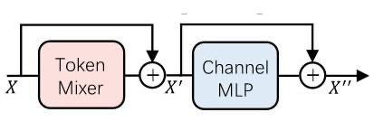
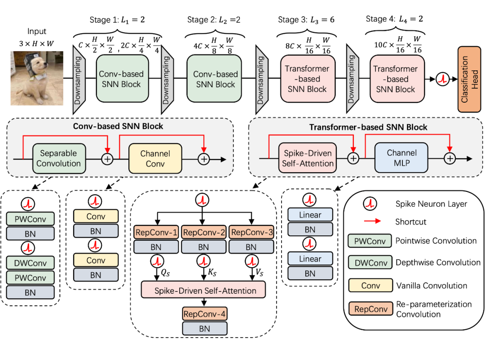
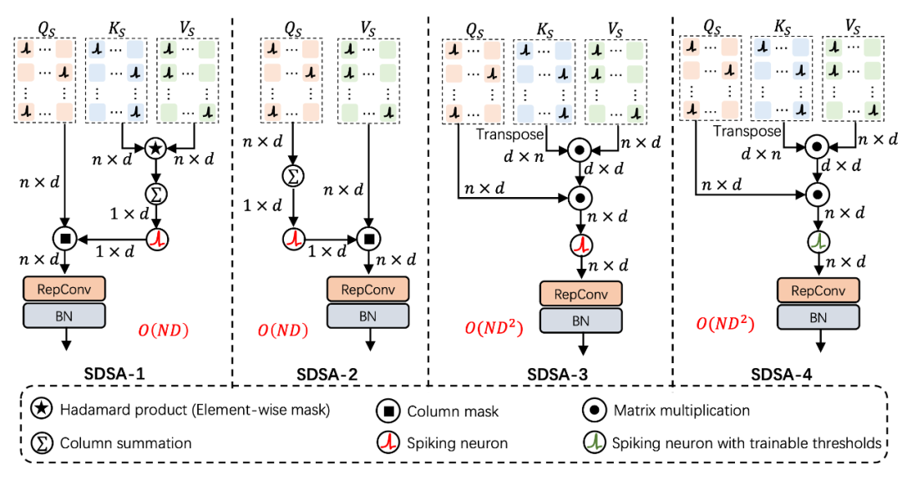
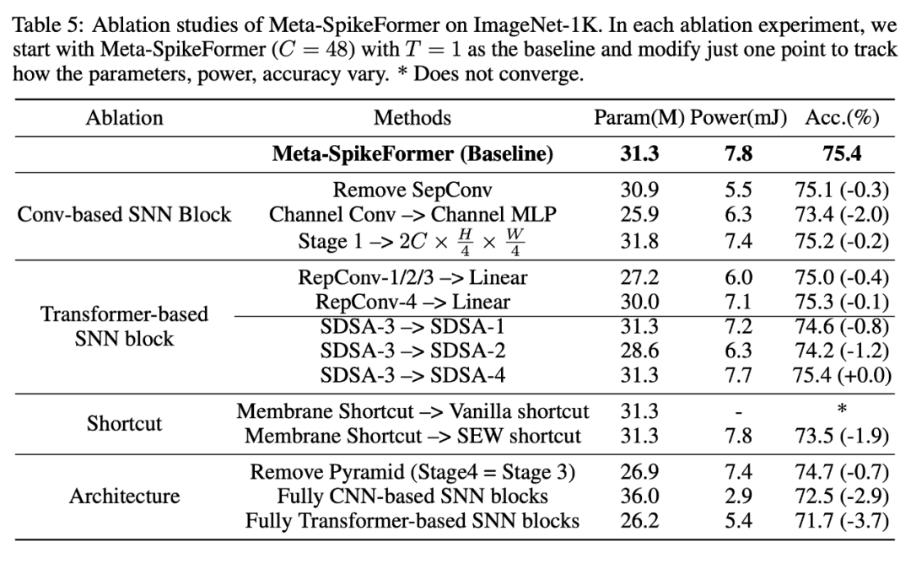
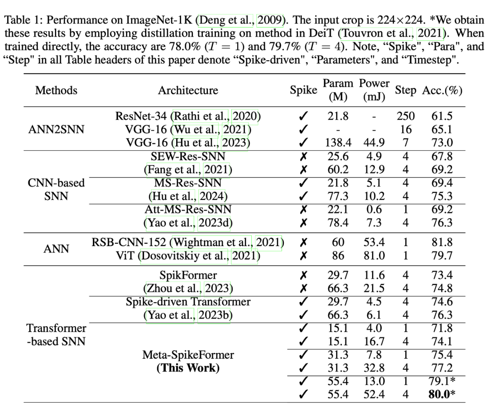
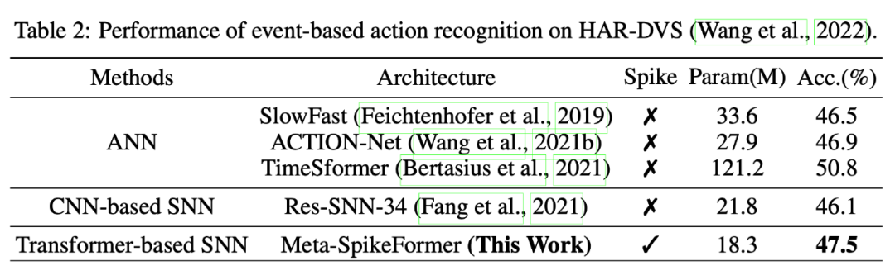
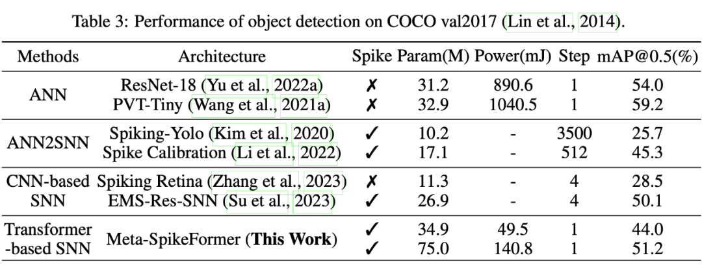
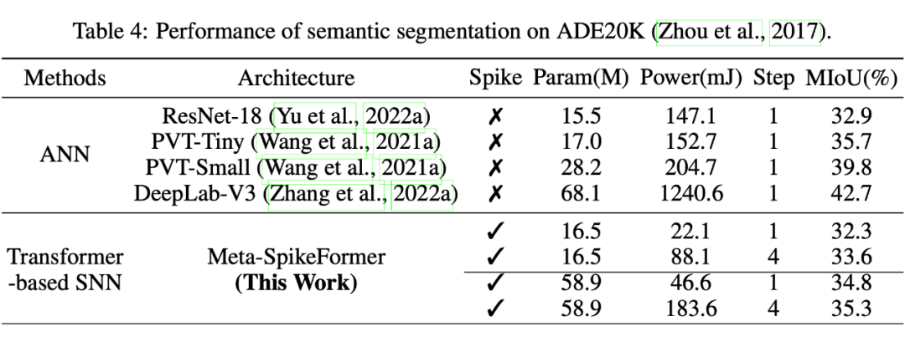

# Spike-driven Transformer V2

> **论文地址：**
>
> Spike-driven Transformer V2: Meta Spiking Neural Network Architecture Inspiring the Design of Next-generation Neuromorphic Chips
>
> **代码地址：**
>
> https://github.com/BICLab/Spike-Driven-Transformer-V2

## **背景**

在神经形态芯片上运行脉冲神经网络（Spiking Neural Network，SNN）的神经形态计算，是类脑计算领域的主流发展方向。CNN-based SNN 是神经形态计算领域内的主流架构，几乎所有的神经形态芯片都支持这一架构。

最近，Transformer-based SNN 架构在 SNN 领域内兴起，并表现出了相当的竞争力，目前尚未有神经形态芯片专门针对这一新兴架构设计。此外，在性能方面，现有 spiking Transformer 架构仅能够与 state-of-the-art 的 spiking CNN 算法相持平，并未表现出明显的优势。

**本文的目标是探索 SNN 的 meta 架构设计，以期在算法和硬件两个层面上推动 SNN 领域的发展。**在算法层面，展示 spiking Transformer 架构相对于 spiking CNN 在**任务性能**和**通用性**方面的优势，缩小 SNN 和 ANN 之间的性能差距。

在硬件层面，spiking Transformer 的元架构设计有助于**减少 Transformer-based SNN 神经形态芯片设计时所需要的算法探索成本****，**推动神经形态计算领域中下一代基于 spiking Transformer 的神经形态芯片的发展。

## **本文贡献**

本文将 Spike-driven Transformer [1] 扩展成一种元 SNN 架构，命名为 "Meta-SpikeFormer". 本文的主要贡献包括：

- **SNN 架构设计。**本文设计了一种仅包含稀疏加法的 meta Transformer-based SNN 架构，主要包括了宏观层面的 Conv-based 和 Transformer-base SNN 块设计，以及微观层面上的设计，包括几种新的脉冲卷积方法，脉冲形式 Q，K，V 矩阵的生成方法，以及三种具有不同计算复杂度的脉冲驱动自注意力（Spike-Driven Self-Atttention，SDSA）算子等。
- **性能。**所提出的 Meta-SpikeFormer 使得 SNN 领域首次在 ImageNet-1K 上达到 **80%**，比当前的 state-of-the-art 基线 Spike-driven Transformer [1] 性能提升了 3.7%，但参数量减少了 17%。
- **通用性。**Meta-SpikeFormer 是首个可以同时处理分类、检测、分割的直接训练 SNN 架构。Meta-SpikeFormer 在 ImageNet-1K，HAR-DVS（目前最大的 DVS 动作分类数据集），COCO，ADE20K 等数据集上进行了实验，并在所有的数据集上取得了 SNN 领域内的最佳性能。这也是 SNN 领域首次在 ADE20K 数据集上报道性能。
- **神经形态芯片设计。**本文系统性地研究了 Transformer-based SNN 的通用组成，包括架构、残差连接、脉冲驱动自注意力算子等。与 CNN-based SNN 相比，Meta-SpikeFormer 表现出明显的性能和通用性优势。这无疑将启发和引导神经形态计算领域开发基于 Transformer 的神经形态芯片。

## **方法**

### **3.1 ANN中Meta Transformer架构的概念**

在 Vision Transformer [2] 展现出令人鼓舞的性能之后，对 ViT 的改进和讨论逐成为架构设计的中流砥柱。各种改进层出不穷，一些典型的工作包括架构设计（PVT 、MLP-Mixer 等）、自注意力增强（Swin、Twins 等）、训练优化（DeiT、T2T-ViT等)、高效 ViT 设计等。

**在这项工作中，我们的目标是从种类繁多的 ViT 变体中参考和探索 meta spiking Transformer 架构设计，以快速缩小 SNN 和 ANN 在架构设计上的差距。**

▲ 图1 Meta Transformer Block.

自注意力机制被认为是 Transformer 架构取得成功的核心，其主要用于聚合不同位置 token 之间的信息（即，token mixer）。基于这一理解，研究者们扩展了许多 token mixer 的替代方案，比如 MLP，傅里叶变换等。其中，Yu 等人 [3,4] 认为，相较于关注某一个具体的 token mixer，一个通用的 meta Transformer 架构也非常重要。

如图 1 所示，一个基础的 meta Transformer 块可以分为两部分，一部分是 token mixer（混合空间信息，例如 self-attention），一部分是 channel mixer（混合通道信息，例如 channel MLP）。

### **3.2 Meta-SpikeFormer设计**

基于 ANN 中 meta Transformer 架构的理解，本文将 spike-driven Transformer [1] 与 [4]中的 CAFormer 对齐。其中，CAFormer 由两个 CNN 阶段和两个 Transformer 阶段构成，这种前卷积/后自注意力的架构是计算机视觉中的经典架构，被认为有助加速网络收敛和提升任务性能 [5]。

具体地，本文将 spike-driven Transformer 中的脉冲编码层扩充为 4 个 Conv-based SNN 块，并对 Transformer-based SNN 块进行了重新设计，如图 2 所示。

▲ 图2 Meta-SpikeFormer架构设计

通过在 Conv-based SNN 中引入深度可分离卷积，利用重参数化生成脉冲形式 Q,K,V，设计三种具有不同计算复杂度的脉冲驱动自注意力算子（如图 3）所示，Spike-driven Transformer 被全面升级。

▲ 图3 具有不同计算复杂度的脉冲驱动自注意力算子

通过调节本文所提出的 Conv-based 和 Transformer-based SNN 块的内部设计细节，可以实现脉冲神经网络在任务精度、参数量、能耗等方面的 trade-off。图 2 中的架构为本文推荐的架构，在 ImageNet 上具有最高的任务精度。进一步地，表 1 给出了不同设计条件下 Meta-SpikeFormer 的表现。研究者们可以根据自身的应用场景基于 Meta-SpikeFormer 对模型进行调整。

▲ 表1 Meta-SpikeFormer架构设计的消融实验

## **实验**

Meta-SpikeFormer 在图像分类，event-based 动作分类，目标检测，语义分割任务上进行了测试。本文利用在 ImageNet 上训练好的模型，在目标检测和语义分割任务进行微调测试。**这是直接训练 SNN 首次能够以统一的方式处理分类、检测、分割这三种任务。**

**4.1 静态图像分类（ImageNet-1K）**

结果如表 2 所示，所提出的 Meta-SpikeFormer 在 ImageNet-1K 上取得了 80% 的性能，是目前 SNN 领域内的最佳结果。

▲ 表2 Meta-SpikeFormer在ImageNet中的实验结果

**4.2 Event-based动作分类（HAR-DVS）**

动态视觉场景（即，神经形态视觉）是 SNN 的典型应用场景之一。DVS 相机只在亮度发生变化时异步输出稀疏事件流。SNN 也能够以异步事件驱动的方式运行，因此天然能够以低功耗、低时延的方式处理 DVS 数据。本文采用目前最大的 DVS 数据集 HAR-DVS 来测试所提出的 Meta-SpikeFormer，结果如表 3 所示。

▲ 表3 Meta-SpikeFormer在HAR-DVS中的实验结果

**4.3 目标检测（COCO）**

我们首先将 mmdetection 代码库转换为 spiking mmdetection 版本。然后在 Meta-SpikeFormer 中加入 Mask R-CNN，在 ImageNet 上预训练的模型被用来初始化骨干网络。为对比公平，本文采取了预训练+微调，直接训练两种方式来评估 Meta-SpikeFormer 在 COCO 上的性能，结果如表 4 所示。

▲ 表4 Meta-SpikeFormer在COCO中的实验结果

**4.4 语义分割（ADE20K）**

本文报道了 SNN 在 ADE20K 上的首个结果。我们将 mmsegmentation 代码库转为相应的 spiking 版本，在 ImageNet 上预训练的模型被用来初始化骨干网络。结果如表 5 所示。

▲ 表5 Meta-SpikeFormer在ADE20K中的实验结果

总之，Meta-SpikeFormer 这些数据集上都取得了 SNN 领域的最佳结果。

## **结论**

### **5.1 Meta-SpikeFormer在技术上如何启发未来的神经形态芯片设计？**

- **Conv+ViT 混合架构设计。**这种混合渐进式局部-全局建模可以同时利用 CNN 和 Transformer 的优势，其中前者进行低层次特征建模，后者捕获长距依赖关系。本文通过充分的实验验证了这种设计有利于 SNN 的性能和通用性。
- **脉冲驱动自注意力（SDSA）算子设计。**SDSA 算子是 spiking Transformer 中进行长距离依赖建模的核心设计，这也是当前神经形态芯片所缺乏的设计。
- **SNN 的 meta 架构设计。**基于本文所设计的 meta Conv-based 和 Transformer-based SNN 模块，研究人员可以根据自己在精度、参数和功耗方面的需求（表 1），对 meta SNN 模块内部的设计细节进行针对性的优化。

### **5.2 Meta-SpikeFormer对神经形态芯片设计的意义**

- **算法-硬件协同设计。**大多数神经形态芯片设计都是从计算堆栈的底部开始的 [6]，也就是，从材料和设备的角度出发。Meta-SpikeFormer 所表现出的高精度和通用性可能会吸引和启发算法驱动神经形态芯片设计。 
- **对大规模神经形态计算的信心。**小规模神经形态计算已经在边缘计算端展现出了明确的功耗和性能优势 [7,8,9]。Meta-SpikeFormer 展示了大规模 SNN 在性能和通用性方面的潜力。
- **降低下一代神经形态芯片设计成本。**Meta 设计有利于大幅缩小 SNN 和 ANN 在架构设计上的差距，降低算法驱动神经形态芯片设计之前所需的算法探索成本。