# Event-guided Person Re-Identification via Sparse-Dense Complementary Learning

> 基于视频的人物再识别（Re-ID）是一个突出的计算机视觉课题，因为它在视频监控领域有着广泛的应用。现有的大多数方法都是利用帧序列中的空间和时间相关性来获取具有辨别力的人物特征。然而，不可避免的退化（如帧中包含的运动模糊）会导致身份识别线索的丢失。最近，一种能异步记录强度变化的新型生物启发传感器--事件相机--为重新识别任务带来了新的活力。它具有微秒级的分辨率和低延迟，即使在退化环境中也能准确捕捉行人的动作。在这项工作中，我们提出了稀疏-密集互补学习（SDCL）框架，通过充分利用密集帧和稀疏事件的互补信息，有效提取身份特征。具体来说，对于帧，我们构建了一个基于 CNN 的模块，逐步聚合行人外观的密集特征；而对于事件流，我们设计了一个生物启发尖峰神经网络（SNN）骨干，以尖峰形式将事件信号编码为稀疏特征图，从而提取行人的动态运动线索。最后，还构建了一个交叉特征对齐模块，以融合来自事件的运动信息和来自帧的外观线索，从而增强身份表征学习。多个基准测试表明，通过在 Re-ID 中采用事件和 SNN，我们的方法明显优于其他同类方法。
>
> `代码`:<https://github.com/Chengzhi-Cao/SDCL>
>
> `论文`：<https://pan.baidu.com/s/17HTbxEYoJlbFuVknmzGj5Q?pwd=pjez>

在本文中，**我们提出了一种稀疏密集互补学习网络（SDCL），以充分提取连续密集帧和稀疏事件流的互补特征，用于基于视频的人物再识别。**首先，**对于密集视频序列，我们构建了一个基于 CNNs 的骨干网络，逐步聚合帧级特征**。**对于稀疏事件流，我们设计了一种可变形的尖峰神经网络，以适应事件的稀疏和异步特性**。由于尖峰神经网络（SNN）具有特定的事件触发计算特性，能以几乎无延迟的方式对事件做出响应，因此它天然适合处理事件，并能通过利用离散化的输入表示保留事件的空间和时间信息。同时，我们引入了可变形操作来处理 SNN 深层的尖峰退化问题，更好地利用事件的空间分布来指导采样网格的变形。最后，为了共同利用稀疏密集的互补信息，我们提出了交叉特征对齐模块，利用事件中清晰的运动信息和帧中的外观线索来增强表示能力。如图 1 所示，事件的特征图仍然保留了事件的稀疏分布，这可以引导基线清晰地捕捉和学习判别表征。与第4行基线(没有事件)相比，第5行学习到的特征图表明，我们的方法更倾向于关注原始帧中最重要的语义区域，更容易选择表征较好的区域。事件的表象表现了特定人物的轮廓和姿态。结果表明，稀疏事件可以指导基线网络清晰地捕获和学习判别表示。密集RGB帧和稀疏事件的特征映射虽然意欲捕获不同的语义区域，但它们仍然具有空间相关性。两者都有助于最终的结果。

> 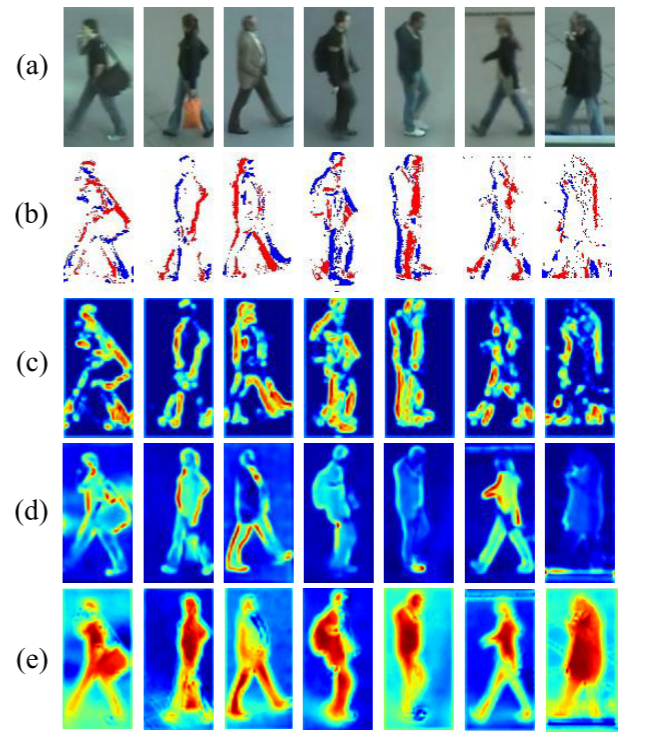
>
> 图 1. 学习到的特征图的可视化示例。从上到下：(a) 原始图像，(b) 相应事件，(c) 事件特征图，(d) PSTA [49] 中帧的特征图（不含事件），(e) 我们网络中帧的特征图（含事件）。

这项工作做出了以下贡献:

•我们引入了一种新的模式，称为事件流，并探索其动态属性来指导人员ReID。据我们所知，这是第一个事件引导解决方案来处理基于视频的重新识别任务。

•我们提出了一个稀疏密集互补学习网络，充分利用稀疏事件和密集帧同时增强在退化条件下的身份表示学习。

•我们设计了一种可变形的尖峰神经网络来适应事件流的稀疏特性，它极大地利用了事件的空间一致性，在轻量级架构中为密集的RGB帧提供运动信息。

**在多个数据集上进行了大量的实验，以证明生物激发事件相机可以帮助改善基线模型的Re-ID性能，并获得比SOTA方法更高的检索精度。**

## 2. 相关工作

基于视频的重新识别。继基于图像的再识别技术的发展[6,7,23,30,38,39,48,58]之后，基于视频的再识别技术最近也取得了许多进展[14,20,40,51,55]。大多数基于视频的 Re-ID 方法都旨在充分利用空间和时间信息，生成不受各种因素（包括人的位置、遮挡等）影响的人像。为了在序列级人物表示中利用图像级特征，Eom 等人[11]引入了时间记忆模块，以保存针对人物视频中典型时间模式进行优化的注意力。Wang 等人[49]探索了帧内的空间相关性，以确定每个位置的注意力权重，并探索了时间一致性信息，以抑制干扰特征并加强辨别特征。Aich 等人[1]提出了一种灵活的新计算单元，用于提取时空维度上的互补信息。

基于事件的视觉。由于事件是生物启发的视觉信号，其形式类似于异步尖峰列车，因此针对基于事件的学习提出了许多生物启发学习方法，如递归神经网络 [4, 9, 25]。此外，还有许多基于 CNNs 的方法来处理事件流。Duan 等人[10]首先部署了 3D U-Net，并加入了 E2I 模块，利用 HR 图像信息对事件进行去噪和超分辨率处理。他们还实施了一个显示摄像机系统，并提出了一个多分辨率事件数据集。Paikin 等人[36] 设计了一种三相架构，将传统帧流与事件摄像机的输出融合在一起。Gehrig 等人[13] 利用成本卷并引入递归，将时间先验纳入来自事件摄像机的密集光流估计。**然而，目前仍没有专门为基于视频的人物再识别设计的事件引导解决方案。**

## 3.方法

### 3.1.概述

如图2所示，我们的方法以时间戳为T的具有相应事件的帧序列作为输入。对于RGB帧，它们被送入ResNet骨干[17]，其参数被训练为ImageNet Classification[28])来提取特征。对于事件流，将它们输入SNN，同时提取事件流的时空特征。然后，帧特征和稀疏事件特征通过交叉特征对齐模块，提取密集帧和稀疏事件中包含的互补信息。最后，我们利用金字塔聚合模块融合了两类特征，增强了身份表示。下面我们将详细介绍SDCL的每个模块。

> 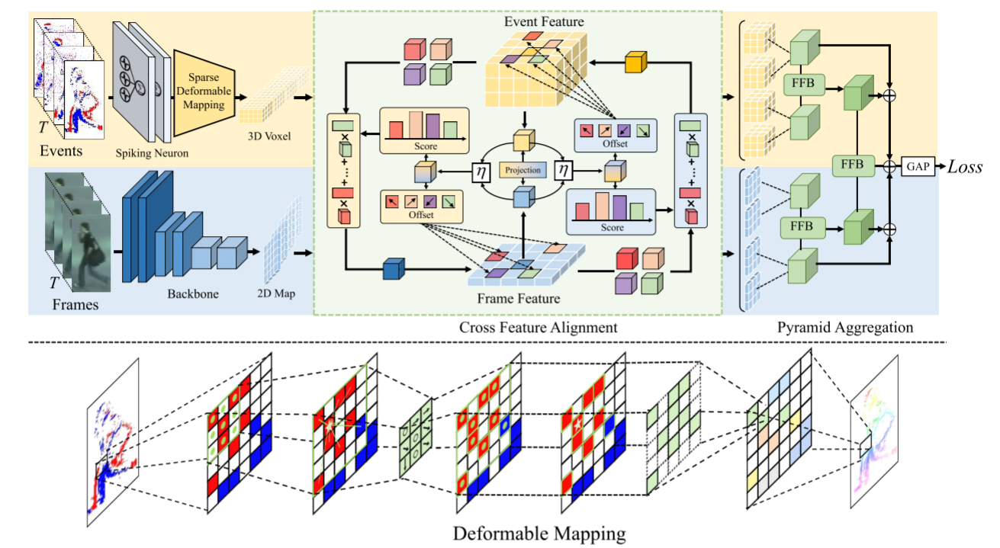
>
> 图2。介绍了稀疏密集互补学习网络(SDCL)的基本概念，并以四帧为例。给定这些帧，我们首先利用ResNet-50[17]作为骨干来提取帧级特征。对于事件，我们采用了Spiking神经网络(SNN)来保留事件的时空分布，并提取事件级特征。在事件的引导下，**利用交叉特征对齐模块计算帧与事件之间的空间一致性，然后进行融合**。最后，**利用金字塔聚合模块对两类特征进行聚合**。“FFB”和“η”操作将在后面讨论。

### 3.2.事件表示

当亮度变化在时间戳t中超过预定义的阈值c时，事件将被记录为(xt, yt, pt, t)，其中(xt, yt)和t分别表示事件的时空位置。Pt∈{+1，−1}表示亮度变化的极性(增减)。极性的计算方法如下:

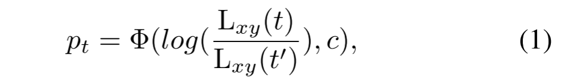

式中，c为决定事件能否被记录的强度阈值，Lxy(t)和Lxy(t’)分别表示t时刻和之前t’时刻的瞬时亮度强度。Φ(·，·)是一个分段函数。

### 3.3.可变形尖峰神经网络(Deformable Spiking Neural Network)

针对事件稀疏性的特点，利用神经网络提取事件特征，并提出可变形映射操作来引导卷积的变形，维护事件中的空间信息。

**尖峰模型（Spiking Model）**事件流的极性表示一个像素处亮度的增加或减少。受生物神经元的动态性和适应性的启发，我们选择LIF模型[42]来平衡生物神经元复杂的动态特性及其数学表达。它被描述为:

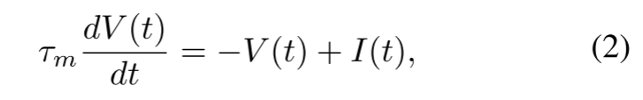

其中，V(t)和I(t)表示t时刻的神经元膜电位和突触前输入，τm为常数。当V(t)超过V时，神经元产生一个脉冲，并将其膜电位重置到初始值。其中I(t)计算为前期峰值的权重和:

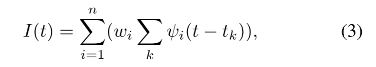

其中n为突触前权值的个数，wi为连接第i个前神经元到后神经元的突触权值。ψi(t−tk)是第i个前神经元在第k个脉冲发生时的脉冲事件。当t = tk时，它的值等于1。每个前脉冲的影响是由相应的突触权重(wi)调制的，以产生电流流入后神经元。因此正向传播为:

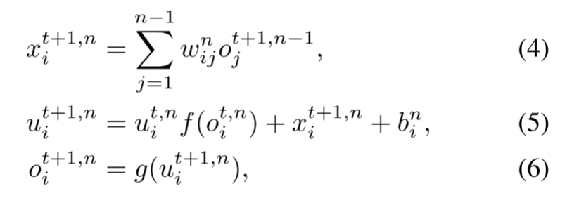

其中n和t表示第n层和时间戳，wij是突触前层的第j个神经元到突触后层的第i神经元的学习权值。$f (x) = τe^{-\frac x τ}$， g(·)为分段函数:

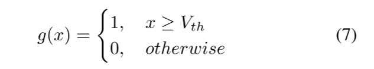

最近的大部分工作\[42][12]表明，峰值的数量在更深的层急剧消失，导致严重的性能下降(如图4所示)。这明显限制了SNN在计算机视觉中的应用。

> 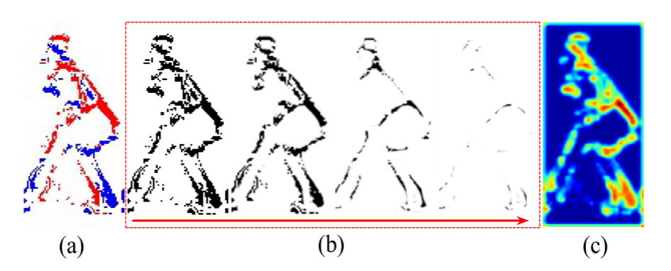
>
> 图4。SNN中的特征可视化和可变形映射。(a)呈现事件;(b)表明，SNN层越深，峰值数量消失的越多。但使用可变形映射(c)仍然可以保留事件的空间信息。

**事件可变形映射（Event Deformable Mapping）**。为解决上述问题，先前的工作[29]证明了 SNN-CNN 混合架构可以保持性能。但是，事件流具有异步性和空间稀疏性，因此其中存在大量边缘。在 RGB 图像中广泛使用的传统卷积法并不适合提取事件特征。受可变形卷积网络[8, 60]的启发，**我们利用事件的稀疏分布来指导卷积的变形，从而解决 SNN 的退化问题**。**传统的可变形卷积并不适用于事件流，因为偏移量是从前面的特征图和 RoIs 中学习的，但事件流中也存在一些无用区域。**因此，我们打算利用事件的分布来直接指导变形。如图 2 所示，**我们将网格 G 定义为感受野。以标准的二维卷积为例，它们会计算相邻像素，但其中一些像素没有事件，因此大部分计算是无用的。**首先，我们定义一个关键事件$（x_0, y_0）$，然后计算与标准内核数量相同的最近事件，并返回它们的坐标{$(x_n, y_n)$|n = 1, ...N}。当我们找到最近的事件时，我们的网格 G 将改变形状并完全覆盖它们。这一操作的计算公式为

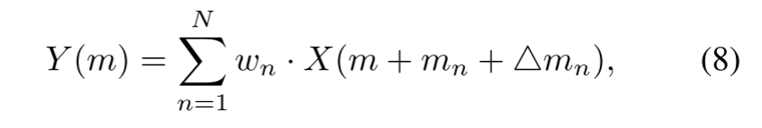

其中，$m_n∈{(-1. -1)，(-1，0)，...，(1，1)}$表示网格 G 中的位置，{$△m_n$|n = 1，...，N}是偏移量，w 是可学习权重，N = |G|。Y(m) 和 X(m) 分别代表输入和输出特征图中位置 m 的特征。我们首先选择一个事件作为中心，然后利用曼哈顿距离捕捉相邻事件 {xn，yn}：

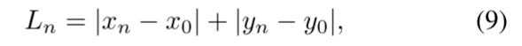

然后我们选择事件最近的位置作为采样点。我们将枚举事件体素中的所有空间位置。偏移量的计算方法如下:

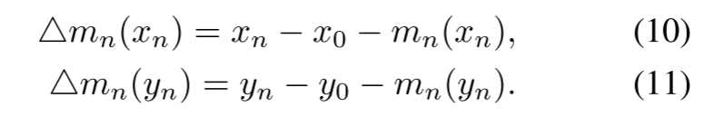

在事件体素中，可变形卷积中心$m_0$和采样区域$m_n +△m_n$将枚举所有事件的位置。通过这种方式，我们的可变形卷积只计算事件的区域，而不考虑体素中的边缘。

### 3.4.交叉特征对齐

该模块的目标是有效地聚集密集的框架特征和稀疏的事件特征。将帧送入主干，如ResNet-50[17]，获得2D feature map，事件序列通过SNN处理，生成3D体素特征。虽然现有的许多注意操作可以直接用于聚合这些异构特征，但它们仍有局限性。例如，由于事件序列中的边缘区域对最终的特征图有很大的影响，因此很难保持空间一致性。**因此，我们为每一帧特征动态地选择三维体素上的几个关键点区域，反之亦然，提取帧和事件的互补特征。我们设计了一个对称的对齐结构，这样每个模式都可以从另一个模式学习额外的属性。**

假设 $F_i$ 是第 i 个位置的图像特征，给定二维特征图 $F = \{F_1，F_2，...，F_{HW}\}$ 和体素特征 P = $\{P_1，P_2，...，P_J\}$，根据体素特征 $P_i = （p^i_x，p^i_y，p^i_z）$计算出图像平面上的参考点 $R_i = （r^i_x，r^i_y）$，计算公式如下：

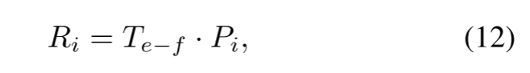

其中$T_{e - f}$是从事件到框架的投影。查询特征$Q_i$被计算为帧特征$F_i$与其对应事件特征$P_j$的元素级乘积。最终操作$η(·，·)$可由以下公式求得:

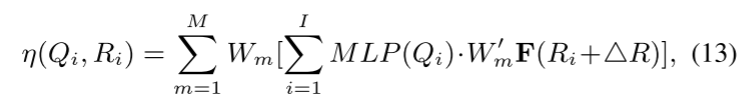

其中，$W_m$ 和 $W^′_m$ 代表可学习权重，MLP 是用于生成注意力分数的多层感知器。**M 和 I 分别为注意力头数和采样位置数。△R 是采样偏移量。公式 13 中的相同运算也用于在二维特征图上为每个体素特征选择关键点区域。**这种互补操作不仅可以借助动态生成的采样偏移进行跨域关系建模，**还可以保持事件和帧之间的位置一致性，从而获得参考点**。将其视为一种多模态学习方法，每种模态实际上都可以从其他模态学习到一些额外的属性。**在交叉特征对齐后，我们会在网络的较低阶段相互增强事件和帧的特征。**事件特征和帧特征都会对最终结果做出贡献。

### 3.5. 金字塔聚合

**为了进一步利用两种模式的空间和时间相关性，并融合两种模式的信息，我们采用了金字塔结构来聚合两种类型的特征**。我们首先利用卷积层来转换与帧特征相同大小的事件体素。然后，将相邻的帧特征和事件特征输入特征融合块（FFB）。我们采用 STAM[49]模块作为 FFB，以获得具有时间感受野的分层特征。分层结构的最终输出特征将通过全局平均池化层。这种对称的多级结构不仅能保持事件和帧之间的空间一致性，还能从中获得长距离的时间依赖性。

### 3.6. 损失函数

三重损失（Triplet loss）和识别损失（Identification loss）被广泛应用于人的再识别（Re-ID）。根据文献[1]，我们采用带标签平滑的交叉熵损失作为识别损失，并加入批量三重损失和硬挖掘策略来优化网络。总损失 Ltotal 是两种损失的组合：

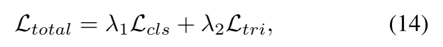

其中，λ1 和 λ2 是两个损失的权重。

## 4. 实验

在本节中，我们提供一些实现细节，并展示消融研究以及可视化来评估我们网络的性能。我们将我们的模型与OSNet[59]、SRS-Net[45]、STMN[11]、STGCN[53]、CTL[33]、GRL[35]、SINet[3]、RAFA[56]、MGH[52]、TCLNet[21]、STRF[2]和PSTA[49]进行了比较。

### 4.1.数据集

由于没有可用的事件人再识别数据集，我们从 PRID-2011 [18]、iLIDS-VID [47] 和 MARS [57]等三个基于视频的经典再识别数据集中生成事件。按照文献[10, 16, 44]的方法，我们应用显示-摄像系统和模拟器 V2E [22]来生成相应的事件序列。更多详情请参见补充材料。

### 4.2.实施细节

我们的网络是基于Pytorch在Intel i4790 CPU和NVIDIA RTX 2080Ti GPU上实现的。我们的CNN编码器的初始化是imagenet预训练的标准ResNet-50[17]。**对于每个视频剪辑，我们使用一种约束随机采样方法，从平均分割的8块中随机采样帧。**我们总共训练我们的网络500个epoch，以0.0003的学习速率开始，每200个epoch衰减10次。应用Adam[27]优化器更新参数。在测试期间，余弦相似度被用来测量图库和查询之间的距离。

### 4.3.与其他方法的比较

表 1 显示了我们的方法与其他 SOTA 方法在 MARS [57]、PRID-2011 [18] 和 iLIDS-VID [47] 上的比较结果。需要注意的是，为了证明互补学习策略优于传统的基于视频的方法，我们根据输入数据的不同将实验分为三组，包括仅视频、仅事件和带事件的视频。当我们将事件视为 CNN 的输入时，我们将其部署到事件体素中，以编码正负事件；当我们将事件视为 CNN 的输入时，我们将其部署到事件体素中，以编码正负事件。这些结果说明 (1) 由于事件流只能捕捉场景中的亮度变化，因此丢失了基于颜色的信息，如内容和饱和度。因此，仅使用事件流无法获得理想的性能，在 MARS 上的最佳值为 30.9% mAP。(2) 当输入为视频和事件（V+E）时，我们保持基于视频的网络结构不变，使用 SNN 提取事件特征，然后将空间融合块 [5] 纳入主流。与基于视频的方法相比，当利用事件来指导基于视频的方法时，其性能大多会得到改善。例如，STMN（V+E）在 iLIDS-VID 和 MARS 上的 mAP 分别提高了 3.1%和 1.6%；CTL（V+E）在 PRID-2011、iLIDS-VID 和 MARS 上的 Rank-1 准确率分别提高了 3.4%、4.7% 和 0.3%。之所以取得如此优异的成绩，是因为事件为基于视频的方法带来了有用的信息。(3) 我们的方法优于 PSTA [49]，在 PRID-2011 和 MARS 上的 mAP 分别提高了 2.2% 和 1.4%。这一对比清楚地表明了互补融合在探索事件与帧之间互补信息方面的有效性。

> 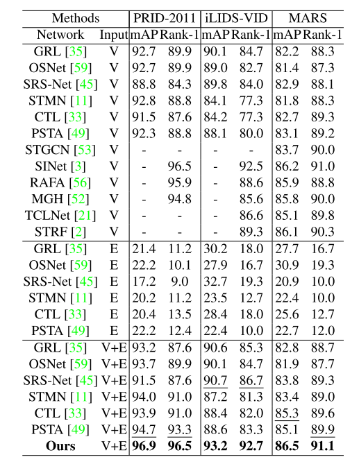
>
> 表 1. PRID、iLIDS-VID 和 MARS 的比较。粗体数字表示最佳性能，带下划线的数字表示次佳性能。输入方面，"V "和 "E "分别表示输入的是图像序列和事件序列。括号中的结果是使用作者提供的源代码得出的。

此外，为了证明我们的方法在退化条件下的鲁棒性，我们在PRID-2011和iLIDS-VID数据集上按照[26]创建模糊和遮挡，实验结果如表3所示。第一组用于处理RGB帧，而第二组同时接收帧和事件。**与表1的结果相比，我们注意到模糊伪影对所有方法的性能都有很大的影响。**例如，PRID-2011的PSTA的mAP值从92.3%下降到79.7%。但是当事件流被输入网络时，它在mAP上取得了很大的进步，在PRID-2011和iLIDS-VID上分别提高了5.3%和12.5%。**在遮挡条件下，我们可以观察到，在iLIDS-VID数据集上，该方法将第二佳方法SRS-Net[45]的mAP准确率提高了6.2%。**这一对比清楚地表明了事件在从视频中探索时空相关性方面的优势。

> 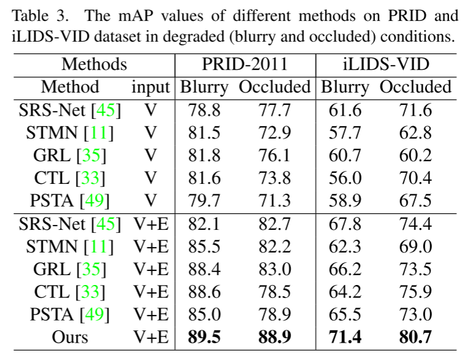

### 4.4.参数和FLOPs

我们在图 5 中列出了所有比较方法的参数和 FLOP。很明显，我们的 SDCL 具有可比的存储消耗，同时考虑到了可接受的 FLOP，从而实现了最高精度。需要注意的是，SNN 可以提高能效并减少参数，因为它只有在接收或发出尖峰时才处于激活状态，而 CNN 在运行时，无论输入或输出值是否为实值，所有单元都处于激活状态。由于在交叉特征对齐模块中，我们将事件特征和帧特征之间所有位置的特征加权相加来计算响应，因此大大增加了 FLOPs。

> 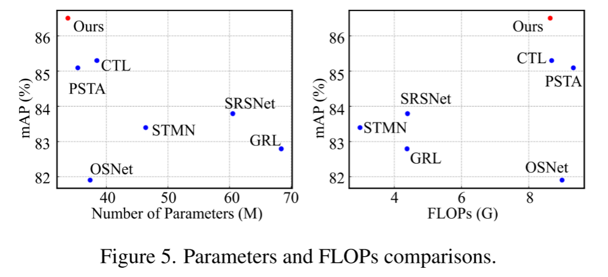

### 4.5.消融研究

SNN 的组成部分。我们评估了 PRID-2011 数据集中每个组件（包括尖峰神经元和可变形映射）的贡献，以证明我们网络的效率。结果如图 6 所示。为了证明 SNN 在较深层的性能下降，我们一般会增加 SNN 的层数。很明显，当我们将 SNN 层数设置为 1 到 2 时，mAP 和 Rank-1 的准确率都有所提高，但当 SNN 层数为 3 时，性能略有下降。

> 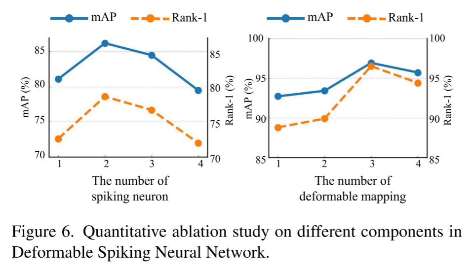

此外，我们还固定了两个 SNN 层，并增加了后续层中可变形映射的数量。在 PRID-2011 和 iLIDSVID 数据集中，mAP 和 Rank-1 的准确率仍在持续上升，这说明我们的可变形映射可以保持事件流的稀疏分布，从而提供额外的亮度信息。然而，不断增加数量最终带来的改进是有限的。因此，我们在实验中选择可变形映射的数量为 3。更多分析见补充材料。

**交叉特征对齐模块的组件**。为了说明交叉特性对齐模块的效果，我们将其与几种广泛使用的操作(包括连接、添加、注意机制和我们的模块)进行了比较。结果如表2所示。很明显，连接和添加对PRID2011和iLIDS-VID数据集有不好的影响。**这是因为它们都直接结合了稀疏事件和密集RGB帧，而没有考虑它们之间的区别。**当使用注意机制时，iLIDS-VID的mAP和Rank-1正确率分别达到90.6%和85.4%，大大高于基线。最后，在PRID-2011和iLIDS-VID数据集中，我们的交叉特征对齐模块分别比注意机制的mAP性能好6.3%和2.4%。为了说明事件与帧之间的互信息，我们也只将我们的模块部署在“E2V”(event-to-video)或“V2E”(video- To - event)中进行实验，验证事件与帧之间的互补效应，实验结果见表2。我们可以看到，事件和框架之间的单一互补学习也可以提高Rank-1准确性和mAP。在“E2V”互补信息的作用下，我们的网络在PRID-2011中获得了92.7%的mAP和89.9%的Rank-1准确率，比“V2E”的mAP和Rank1分别提高了2.8%和4.5%，这意味着事件的稀疏分布更有利于RGB帧获得更好的性能。可以解释为密集的RGB帧包含了丰富的全局上下文信息和人体的物理连接，但事件流也可以为基于视频的Re-ID提供额外的亮度信息。

> 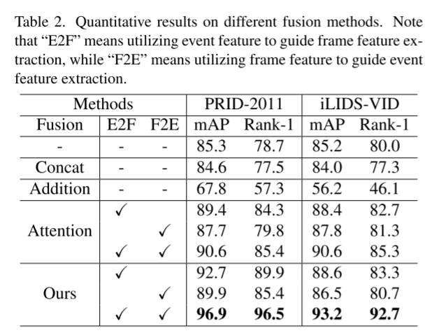

**金字塔聚合**。我们通过将特征与残差块聚合在一起来评估金字塔聚合，以证明特征融合块（FFB）的优势。表 4 显示，金字塔聚合结构实际上可以获得更好的性能。

> 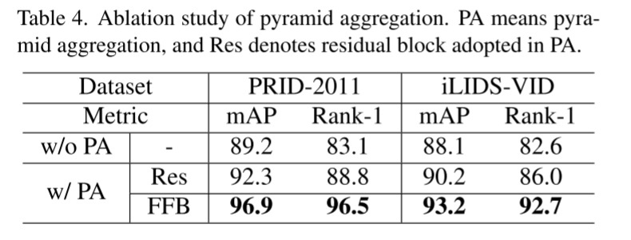
