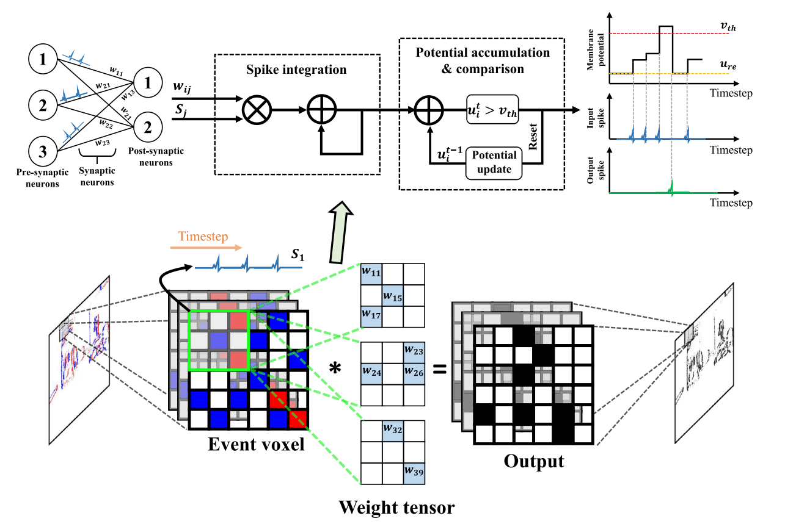

# Event-Driven Video Restoration With Spiking-Convolutional Architecture

> 2023 IEEE TRANSACTIONS ON NEURAL NETWORKS AND LEARNING SYSTEMS 
>
> 
>
> 为了帮助**还原低质量（LQ）视频序列**，大多数现有的基于事件的方法通常采用卷积神经网络（CNN）来提取稀疏事件特征，而不考虑相邻事件的空间稀疏分布或时间关系。为了解决这个问题，我们提出了一种新的尖峰-卷积网络（SC-Net）架构，以促进事件驱动的视频修复。具体来说，**为了正确提取事件数据中包含的丰富时间信息，我们利用尖峰神经网络（SNN）来适应事件的稀疏特征，并捕捉相邻区域的时间相关性**；为了充分利用事件和帧之间的空间一致性，我们采用 CNN 将稀疏事件转换为额外亮度，然后再感知视频序列中的细节纹理。通过这种方法，相邻事件的时间相关性和两类特征之间的相互空间信息都得到了充分挖掘和利用，从而准确地还原了细节纹理和锐利边缘。在合成和真实世界基准上进行的大量实验表明，我们的方法比现有的竞争方法表现更好。
>
> `论文`：<https://pan.baidu.com/s/1UogPxefbZsI3cjhhO_tpMQ?pwd=gqjn>

VIDEO是计算机视觉的重要数据源。与单一的图像相比，视频包含了丰富的时空信息，因此很多研究者都关注视频在日常生活中的应用。然而，现实场景中录制的视频往往会受到各种退化因素的影响，如分辨率低、恶劣天气、[2]、[3]模糊等。这些退化往往导致详细信息的丢失，严重影响视觉体验。为了解决这一问题，视频恢复的目标是从低质量(LQ)测量中获得视觉上令人满意的高质量帧序列。它在许多计算机视觉任务中起着基础性的作用，如[4]、[5]、[6]的跟踪和视频生成。近年来，随着卷积神经网络(convolutional neural network, CNN)的广泛应用，研究者在视频去模糊[7]、[8]、[9]以及视频超分辨率[10]、[11]、[12]等多种恢复任务中都取得了很好的效果。**虽然它们在某些场景下是有效的，但在高速或复杂环境下的高动态场景中出现严重的运动模糊时，它们可能会出现不足。由于视觉信息的大量丢失，还原场景细节几乎是不可能的。**

最近，一种名为 "事件相机 "的新型生物启发传感器为视频修复提供了新的视角。与传统相机以固定速率捕捉帧的成像过程不同，事件相机异步记录每个像素的亮度变化，并生成事件流来编码亮度变化的位置、时间和极性 [14]、[15]、[16]。事件摄像机具有低延迟、高动态范围和高时间分辨率的特点，可以在很短的时间内精确捕捉像素的变化，提供更详细的帧间过渡。由于其众多优点，事件相机已被广泛应用于视觉处理和分析，包括视频修复。然而，它们仍有一些局限性[17]、[18]。**首先，目前的视频修复方法 [19], [20] 将事件作为额外信息，而没有考虑相邻事件之间的关联，因此无法充分利用事件的高时间分辨率。其次，这些网络忽略了事件与帧之间丰富的时空关联性，只是将它们或其特征图（如图 1(b) 和 (c) 所示）串联起来作为 CNN 的输入。**然而，事件的部署对于视频还原至关重要，因为事件会异步记录场景光照的变化，从而呈现视场中物体的移动。上述问题阻碍了事件驱动视频修复研究的进一步发展。

> 
>
> 图1。现有视频恢复方法的分类。(a)仅由LQ帧馈送的基于cnn的网络。(b)在将事件和帧发送到基于cnn的网络之前，沿着通道维度直接连接它们。(c)利用CNN提取事件和帧的特征并融合。(d)提出的混合网络，包括SNN和CNN，分别对事件和帧进行编码。

针对上述局限性，我们开发了一种尖峰-卷积网络（SC-Net）架构来解决事件驱动的视频还原问题，即广泛利用事件和帧之间的空间一致性来恢复空间纹理，并探索事件序列中的时间相关性，以不断捕捉它们之间的长期依赖关系。**具体来说，为了利用事件的高度时间相关性，我们提出了尖峰神经时间记忆（SNTM）模块，以持续恢复各种事件序列之间的时间信息。该模块通过采用尖峰神经网络（SNN）来适应事件的分布，并计算相邻事件的长期依赖性以捕捉时间相关性。然后，我们在 CNN 的基础上建立了帧-事件空间聚合（FESA）模块，通过计算帧与事件之间的非局部特征来捕捉空间一致性，从而融合两种类型的特征。如图 1(d)所示，考虑到事件的稀疏性，混合网络部署了 SNN 来处理事件，同时将帧输入 CNN 来提取空间特征**。与图 1(a)-(c)相比，我们的 SC-Net 架构旨在持续保留事件序列的空间和时间特征。此外，所提出的网络架构还能应对不同的底层视觉任务，包括视频去模糊、视频超分辨率和视频去雨（deraining）。

我们工作的主要贡献如下。1) 我们提出了一种统一的 SC-Net 架构，该架构能够充分探索和利用帧与事件之间的时空相关性，从而重建高质量的帧。2) 为了有效利用事件的高时间分辨率，我们提出了 SNTM 模块，在每个时间戳中捕捉事件序列的长期关系。该模块将亮度变化作为额外的先验值进行转换，以感知细节纹理。3) 为了利用空间一致性，我们提出了一个 FESA 模块，该模块提取帧与事件之间的空间相关性，以利用它们的互补信息。4) 广泛的实验证明了我们的方法在一系列修复任务中的有效性，包括视频去模糊、超分辨率和去污。数值结果证实了我们方法的优越性。

本文的初步版本见[21]。新的贡献主要来自四个方面:1)研究了SNN处理事件的性能，并利用SNN处理事件的稀疏特性，合理提取事件的时空信息;2)我们重新设计了我们的网络，发现所提出的混合架构获得了比我们之前的STRA[21]方法更好的性能，例如，在GoPro数据集上，在几乎相同的参数数下，它获得了0.46 db的峰值信噪比增益;3)我们之前的工作[21]只处理视频的去模糊，在本工作中，我们将我们提出的方法扩展到视频的超分辨率和去模糊，并将我们的方法与**之前的工作[21]**进行比较，说明我们的模型的优越性能;4)我们对原始版本进行了大量的分析，如SNN的影响、SNN的可视化和网络参数。

> [21]:IJCAI-22 Event-driven Video Deblurring via Spatio-Temporal Relation-Aware Network 
>
> 
>
> 我们工作的主要贡献有三个方面：•我们提出了一种时空关系感知网络，用于准确的事件驱动视频去模糊。我们的网络通过正确融合帧和事件的功能实现了更好的性能。•提出了一种新的空间融合块来建模帧和事件之间的空间关系，极大地利用了空间一致性开发了一个时间记忆块来记录每个时间步长中事件序列的长范围依赖性，以有效地利用事件的时间信息。•大量实验表明，我们的方法可以产生高质量的去模糊结果，例如，在HQF数据集上，与[Xu et al.，2021]相比，我们的网络实现了1.3dB的卓越性能。

本文的结构如下:第二部分是事件驱动视频恢复的相关研究综述。第三节介绍了我们提出的SC-Net架构。第四节讨论了三个视频恢复任务的实现细节和实验结果。第五节介绍了我们的方法的一些局限性，第六节对我们的工作进行了总结。

## ii.相关工作

### A.事件驱动视频恢复

事件摄像机以微秒级记录场景的强度变化，具有微弱的功耗[22]，在视频恢复中有潜在的应用，包括去模糊[8]、[17]、超分辨率[23]、[24]和重建[25]。**基于事件的视频恢复方法可分为模型驱动算法和数据驱动算法两大类。**基于模型的算法依靠物理事件生成原理来重建高质量的帧。然而，由于物理实现的不完善，包括固有的噪声和有限的带宽，时间和空间域的真实事件不可避免地降低性能。Pan等人[26]用二重积分模型描述了基于事件的运动模糊。**然而，事件相机的噪声硬采样机制往往会导致强烈的噪声积累和场景细节/对比度的损失**。Jiang et al.[17]提出了基于事件的运动去模糊的顺序公式，并将其优化步骤展开为端到端深度架构。然而，这些方法中的事件模块过于琐碎，无法整合到其他现有的网络中，这使得它无法从最先进的视频去模糊方法中获益。数据驱动算法[23]、[27]利用神经网络解决了上述局限性，并借助事件直接学习LQ图像与一系列清晰图像之间的关系。**为了训练的目的，通常从清晰的视频序列中模拟由标记事件和模糊图像组成的合成数据集**。Wang 等人[19]建立了一个基于 GoPro[28] 的合成数据集，将事件、LR 模糊图像和高分辨率（HR）锐利清晰图像连接起来，并提出了一种稀疏学习网络来恢复事件相机中的高质量图像。与上述方法相比，我们提出的方法在以下几个方面有所不同： 1）我们考虑了不同事件的长程依赖性，以恢复事件的时间相关性；2）我们通过改进的非局部操作来计算事件和帧之间的空间一致性，以捕捉退化的上下文；3）我们的统一框架可以解决多种恢复问题，如去模糊、超分辨率和去雨（deraining）。

### B. 尖峰神经网络

SNN 是一种生物启发网络，通过使用仿生尖峰神经元作为计算单元，可以自然地适应事件流的异步和稀疏特性 [29], [30]。为了再现这种基于尖峰的异步机制，人们提出了不同抽象程度的多种尖峰神经元模型。生物物理公式可以准确地表达神经动态，但其复杂性限制了它们在大规模网络中的应用 [31]，[32]。由于它具有特定的事件触发计算特性，能以几乎无延迟的方式对事件做出响应，因此天然适合处理事件，并能通过利用离散化的输入表示保留事件的空间和时间信息。Yao 等人[33]提出了一种时空注意力 SNN，通过在时空输入中实施注意力机制来过滤无用帧，从而实现事件流分类。Paredes-Vallés 等人[34]提出了一种基于尖峰时间依赖性可塑性学习的卷积 SNN 光流估计方法。这些研究的主要局限性在于它们采用的是浅层 SNN 架构，因为深度 SNN 在性能方面存在缺陷。有鉴于此，一种混合方法有望获得 SNN 和 CNN 的优势。

## iii.方法

### A.事件表示

事件驱动视频修复技术旨在通过一个时间步长 T 及其对应的事件序列 $E_T$，从低质量帧 {$B_T$} 中恢复高质量帧 {$I_T$} 。

其中$(x_n, y_n)$和$t_n$分别表示第n事件的时空位置。$P_n$∈{+1，−1}是极性(增加或减少)。极性由

其中c为决定事件能否被记录的强度阈值，$L_{xy}(n)$和$L_{xy}(n−1)$分别表示时间n和n−1时位置(x, y)的瞬时亮度强度。$\phi(·，·)$是一个分段函数

许多基于深度学习的方法通过学习映射函数来解决这个问题，即

其中f(·，·)是LQ帧B和事件E到对应的高质量帧I的表示。

### B.网络结构

我们所提议的SC-Net架构的概述如图2所示。首先，我们的网络将三个LQ帧输入编码器来提取帧特征。然后，SNTM模块将连续捕获不同序列事件之间的时间信息，利用事件中的时间信息。此外，提出了FESA模块，通过计算非局部相关来融合两类特征。

> 
>
> 图 2. 我们提出的方法的整体架构。它包含两个专门设计的模块：SNTM 模块和 FESA 模块。给定三重模糊连续帧 {BT-1、BT、BT+1} 及其对应的事件序列 {ET-1、ET、ET+1}，SNTM 可以通过计算它们之间的空间一致性来融合它们；FESA 可以按时间顺序连续捕捉相邻事件序列的长期相关性。

### C. SNTM模块

> 
>
> 图 3. SNTM 模块的结构。输入事件序列被送入 SNN 提取特征，然后，"特征阅读器 "计算相邻事件的相关性。

SNTM模块的结构如图3所示。对于事件摄像机，事件流的极性表示给定像素的亮度是增加(ON)还是减少(OFF)。在生物大脑系统中，一个接受刺激并发出脉冲的神经元可以使用泄漏的整合-点火(LIF)模型来建模。可以计算如下:

式中，$V^l$为神经元后膜电位，$τ_m$为膜电位衰减时间常数。输入电流C(t)可以计算为每个时间戳前峰值的权值和

其中$n_l$为突触前权值的数量，$w_i$为连接前神经元到后神经元的突触权值。$θ_i (t−t_k)$是第i个前神经元在$t_k$时刻的一个峰值事件，可以表示为:

其中$t_k$为第k个发生尖峰的时间瞬间。为了训练和推理，LIF模型的迭代表示可以描述为

其中，I[t] 是时间步 t 时的输入电流，D[t] 和 V[t] 分别表示神经元动态变化后和触发尖峰后的膜电位。$\Theta(x)$ 的定义是：当 x ≥ 0 时，$\Theta(x)$= 1；当 x < 0 时，$\Theta(x)$= 0。$V_{th}$ 是发射阈值，S[t] 是输出尖峰，如果出现尖峰，它等于 1，否则等于 0。$V_{reset}$ 是复位电位。函数f(·)描述了神经元的动力学特性，对于不同的尖峰神经元模型有不同的表现形式

其中τ表示膜时间常数。SNN的具体操作如图4所示。

> 
>
> Fig. 4. Detailed SNN operations.

对于 SNN 的训练方法，在通过网络（包括 SNN）对所有连续事件和帧进行前向传播后，对总损失进行评估。由于神经元模型的不连续性和不可分性，标准的反向传播算法无法以其原始形式应用于 SNN。**我们采用近似梯度法 [35] 通过 SNN 层反向传播误差。近似 IF 梯度的计算公式为 (1/Vth)，其中阈值表示尖峰输出相对于输入的变化。**在前向阶段，SNN 层中的神经元将尖峰输入的加权和累积到膜电位中。如果膜电位超过阈值，神经元就会发出尖峰作为输出并复位。**最后的 SNN 层神经元只是将尖峰输入的加权和整合到输出累加器中，而不产生任何尖峰作为输出。在最后一个时间步，SNN 层的整合输出传播到 CNN 层。前向传递后，评估最终损失，然后使用标准反向传播法在 ANN 各层进行梯度反向传播。**

与传统的卷积层相比，脉冲神经元可以很好地保持空间和时间动态。然而，**最近的大部分工作已经证明，峰值的数量在更深的层急剧消失，导致性能[36]严重下降，如图5所示。**因此，在我们的尖峰神经提取中，使用了两个LIF神经元来提取事件特征。

> 
>
> 图 5. 深层 SNN 退化的可视化。从左到右，SNN 的层数越来越深，但尖峰的数量却急剧减少。

所提出的 SNTM 模块有一个特征库和一个特征读取器。对于 T - 1 和 T + 1 中的相邻事件序列，部署一个常用尖峰神经层（SNL）和两个专用尖峰神经层（SNL）来获取键和值。它们各自的尖峰神经层被部署在公共特征图 $F_m$ 上，这样每帧的所有键和值都将按时间顺序存储在特征库中。等式如下

在特征读取器中，将相邻事件的键和值串联起来，计算查询和键之间的相似度来表示与当前事件的时间相关性。这样，当前序列与其相邻序列之间的时间相关性将被完全利用来捕获长期依赖关系。

### D. FESA模块

基于不同尺度[37]的尺度内特征的非对称整合，将三个独立的特征映射调整为相同尺度，并将其连接起来与事件特征进行融合。可以表示为

其中 $CB_1-CB_3$ 表示三个独立的特征图，CB 是特征融合的输出。为了保持与帧特征相同的比例，我们还为事件使用了降采样层。然后，通过考虑每个帧中所有区域与其对应事件之间的空间相关性，采用非局部注意力操作来融合帧和事件的空间特征[38], [39]。

其中，E 和 F 分别表示事件特征图和 LQ 帧特征图，i 和 j 表示位置索引。函数 g(·) 计算位置 j 上的特征图表示。我们设置 C(x) = N 来对最终结果进行归一化处理，其中 N 是特征图中的像素数。函数 f(·, ·) 的计算公式为

最后，我们通过将输出上采样到三个地图$（EB_1-EB_3）$来部署多尺度分割，从而与 U-net 解码器的特征地图相连接。图 6 显示了 FESA 的结构。传统的非局部网络只计算单一特征图中所有特征的加权和，而我们的 FESA 则不同，它结合了三个不同尺度的帧特征图，并记录了与相应事件序列的相关性。

### E. 损失函数

在我们的工作中，均方误差(mse)被应用于端到端方式训练我们的网络

其中$I_{x,y}, \hat I_{x,y}$分别对应ground truth的值和我们网络在(x, y)位置的输出值。

## Iv.实验

### A.数据集

GoPro [28]： 在训练过程中，它包含 2103 对没有对应事件的模糊和清晰帧，在测试过程中包含 1111 对。根据文献[19]，我们通过在连续帧之间插值 7 幅图像来提高帧频，然后根据插值的高帧频序列生成事件和模糊图像。V2E [40] 模拟器用于生成相应的事件序列。为了增加噪声的多样性，我们从高斯分布 N（0.18，0.03）[8]中为像素级设置了不同的合约阈值。根据文献[27]，图像被降采样到较小尺寸，以匹配真实事件摄像机。表 I 提供了一些细节，其中列出了不同场景序列 #seq、图像大小和相应模糊图像 #AVG 曝光时间内的平均事件数。

HQF[18]:它由清晰的地面真实帧和相应的事件组成，这些事件是由DAVIS240C事件相机[14]同时捕捉到的，这些相机曝光良好，几乎没有运动模糊。在[27]之后，我们用与GoPro数据集[28]相同的方法合成运动模糊。此外，由于HQF是在真实世界中捕获的，我们也将其作为视频SR任务中的真实世界测试数据集，以证明我们的方法在真实世界场景中的鲁棒性。

Need for Speed-SR：继 [24] 之后，我们依靠合成数据集来训练我们的网络，因为没有包含 LR 帧、地面实况 HR 帧和相应事件流的公开数据集。具体来说，我们采用速度需求（NFS）[41] 作为数据源，并将所有帧降低采样为 128 × 128 作为 LR 帧。相应的事件流由 V2E[40]生成，HR 帧则根据上标系数（×2 和×4）以不同比例生成。最后，从 132 个视频序列中生成了 3828 个图元。为了评估我们的方法，测试数据集与文献[24]相同，包含 841 幅强度图像和 19 个视频中两个连续帧之间的相关模拟事件流。

NTURain：由 Chen 等人提出[42]。摄像机拍摄的视频每个片段都有不同的运动，例如，缓慢平移且运动不稳定，或安装在快速移动的车辆上。雨滴条纹是通过可调参数合成的，如雨滴大小、不透明度、场景深度、风向和相机快门速度。它有 24 对雨序列，其中清晰版本用于训练，8 对用于测试。相应的事件也由 V2E [40] 生成。

### B.实施细节

我们随机裁剪256 × 256大小的帧，并以0.5的概率水平翻转它们以扩大训练集。ADAM优化器[43]的参数β1 = 0.9， β2 = 0.999，并以8个批量训练我们的网络。初始学习速率设定为10−4，每50个epoch下降25%;最大训练时间是200。该框架在Pytorch中实现，实验部署在**单个NVIDIA RTX 2080Ti GPU**上。

### C.评估指标

图像质量是指图像的视觉属性，侧重于观众的感知评价。我们选择PSNR、结构相似度指数(SSIM)和感知图像贴片相似度(LPIPS)作为度量指标。

1) 峰值信噪比： 它通过最大像素值和图像之间的 mse 来定义。给定具有 N 个像素的地面实况图像 I 和重建图像 $\hat I$ ，PSNR 值可计算为

这里L在一般情况下等于255，使用8位表示。由于PSNR只与像素级mse相关，只关心对应像素之间的差异，而不关心视觉感知，因此在真实场景中，我们通常更关心人类感知，因此在再现质量方面往往表现不佳。

2) 结构相似性指数： 结构相似性指数是基于亮度、对比度和结构方面的独立比较，用于测量图像之间的结构相似性。对于具有 N 个像素的图像 I，亮度 $µ_I$ 和对比度 $σ_I $分别作为图像强度的平均值和标准偏差来估算。此外，亮度、对比度和结构的比较函数（分别表示为 $C_l (I, \hat I )$、$C_c(I, \hat I ) $和 $C_s(I, \hat I )$ ）可计算为

其中，α、β和γ是调节相对重要性的控制参数。

3) 感知图像补丁相似性： Zhang 等人[45]收集了一个大规模的感知相似性数据集，根据经过训练的深度网络在深度特征上的差异对 LPIPS 进行了评估，结果表明 CNN 学习到的深度特征对感知相似性的建模效果远远好于没有 CNN 的测量。

### D.视频去模糊

在本节中，我们比较了我们提出的框架与几种最先进的视频去模糊方法的性能，包括eSL-Net[19]、STRA[21]、STFAN[1]、RED-Net[27]、MemDeblur[46]、LEDVI[8]、GShift-Net[47]、DLEFNet[48]和EVDI[44]。

表 II 显示了 GoPro 和 HQF 数据集的性能。需要注意的是，当输入为视频和事件（"V + E"）时，我们不改变基于视频的网络的原始结构，使用 CNN 主干网提取事件特征，然后使用注意力模块将其输入主流。很明显，当我们将事件流和帧同时输入这些网络时，大多数网络的 PSNR、SSIM 和 LPIPS 值都比只输入视频要好。例如，在 GoPro 数据集中，在事件的引导下，RED-Net [27] 和 STFAN [1] 比没有事件的视频条件分别提高了 1.82 和 1.45 分贝。在 HQF 数据集上的增益甚至更大。此外，实验还表明，与其他竞争方法相比，所提出的框架在所有指标上都表现出色，在 PSNR 方面比 MemDeblur [46] 提高了 2.88 分贝。这是因为我们的方法可以有效地充分利用事件的高时间信息，捕捉相邻事件之间的时间关系，作为重建锐边的额外前提。

与其他最先进的方法相比，性能收益与视觉结果是一致的。图7和图8分别是我们的方法和其他比较方法在HQF和GoPro数据集上的去模糊结果。请注意，“GT”是“ground truth”的缩写，意思是没有任何模糊的高质量图像。视觉质量比较表明，通过正确的帧和事件组合，可以实现具有更多结构细节的高质量视频去模糊。**例如，在图8的第三行中，我们提出的方法可以更好地去除字母“U”的模糊边缘。而其他网络，如LEDVI[8]、eSL-Net[19]，则无法恢复清晰边缘。此外，在图7的第四行中，我们可以看到在模糊过程中，树的边缘会产生各种不需要的伪影。所有比较的方法都不能解决这个问题。然而，所提出的框架可以产生更好的视觉效果，更接近地面真实。**虽然LQ帧存在明显的模糊，但事件也可以记录清晰的场景运动模式，从而指导运动去模糊。

> 
>
> 图8。事件驱动视频去模糊在HQF数据集中的定性比较，其中第三行为室外图像，其他行为室内图像。第一列是第二列中模糊图像对应的事件。

### E.视频超分辨率

我们的方法与BSRDM[49]、STRA[21]、eSL-Net[19]、EvInt[24]、EVSR[23]、LBNet[50]、MRVSR[51]、SLS[52]和TTVSR[53]等几种最新的方法进行了比较。

1) 合成视频 SR：SR × 2 和 SR × 4 的 PSNR、SSIM 和 LPIPS 结果见表 III。从中我们可以看出一些问题。首先，大多数基于视频的 SR 网络都能在事件的帮助下获得明显改善。以 EVSR [23] 为例，它在 SR × 2 和 SR × 4 中的 PSNR 分别提高了 1.26 和 0.86 分贝。其他竞争方法也能从事件中获得类似的优势。这是因为事件可以提供关于场景中高频细节的额外先验信息，而这些先验信息有助于最终的 SR 结果。其次，正如预期的那样，在 "V + E "条件下，我们的方法在 SR × 2 和 SR × 4 任务中都取得了可喜的结果。具体来说，它在 SR × 2 中的 PSNR 值达到了 36.01 dB，是所有方法中性能最高的。与 STRA 相比，我们的 PSNR 平均提高了 0.46 dB，LPIPS 平均提高了 0.03 dB。与其他方法相比，我们的方法遥遥领先。

**我们的方法不仅在定量评价方面优于以上所有的比较方法，而且在视觉上也产生了赏心悦目的效果**。在图9中，我们显示了NFS数据集中×4规模上的一些视觉比较。我们可以看到，大多数最先进的方法在LR帧中丢失了很多纹理细节，尽管MRVSR可以恢复部分区域。在图9的第三行中，可以明显的看到事件捕捉到了场景中物体清晰的边缘，这有利于从LR中恢复细节纹理。然而，大多数比较网络不能充分利用事件来恢复丢失的信息。相反，如果适当地利用事件和帧之间的时空相关性，我们的方法可以获得更清晰的视觉效果。

2) 真实世界视频 SR：为了进一步说明我们提出的方法的性能，我们对真实世界的帧与 HQF 数据集中的相应事件进行了超级解析。结果如图 10 所示。对于第一行中的字母 "Theo"，BSRDM 和 eSL-Net 都包含一些不需要的模糊伪像，但我们的方法生成的纹理更清晰锐利。此外，在图 10 的最后一行，所有对比方法都无法重建海报中 "人 "的面部，纹理退化严重。然而，我们的网络仍能产生较好的定性结果。这些比较验证了时空关系感知机制的优越性能，使我们的方法能够在不同的未知退化条件下保持鲁棒性。

### F. 视频去雨

我们将我们的方法与DIP[54]、STRA[21]、SPAC[42]、MCSC[55]、D3R-Net[56]、RSRV[57]、TCLMC[58]、J4R-Net[59]和VRGNet[60]进行了比较。

对于视频去雨任务，表四显示，我们提出的方法在所有指标上都取得了更好的性能，显著优于当前最先进的方法。与次优算法STRA相比，该方法在PSNR下的性能增益为0.28 dB，在SSIM下的性能增益为0.01 dB。此外，与其他方法相比，我们的方法比MCSC[55]提高了1.80 dB，比D3R-Net[56]提高了2.43 dB，比J4R-Net[59]提高了2.74 dB。显然，在视频网络中添加事件时，它们都获得了不同程度的增益，这说明了事件引导对视频解题的好处。

在NTURain数据集上的一些视觉比较如图11所示。我们有几个观察结果。

1) 事件相机不仅可以记录视场内物体的运动，还可以检测雨天运动的条纹。以最后一排为例，事件展示了街道的尖锐边缘，以及小区域的细雨条纹。这意味着高时间分辨率的事件有利于对雨带的认识。

2) 虽然TCLMC和DIP可以检测并去除雨纹，但不能很好地恢复缺失的细节。

3) SPAC和MCSC生成的纹理有或多或少的明显条纹，而我们的网络可以恢复全局纹理信息。总之，我们回收的无雨框架在定性和定量上都取得了更好的性能。

### G. 消融研究

1) 事件效益： 事件对视频还原的影响见表 II-表 IV。我们在有事件和无事件条件下测试了所有对比方法。我们可以看到，事件驱动方法（"V + E"）的性能优于基于视频的方法，这意味着在不同的修复任务中，事件确实能带来明显的收益。此外，在事件的指导下，所提出的框架也能取得比其他所有网络更优越的性能。

2) FESA和SNTM:我们使用GoPro数据集来验证SNTM模块的显著性，在表五的前两行中存在显著的量化性能差距。这表明，由于借助相邻事件之间的时间相关性，HQF数据集的PSNR增益为0.91 dB, GoPro数据集的PSNR增益为1.23 dB，去模糊性能得到有效提高。

> 

3.  SNN 的效果： 我们还评估了 SNN 的效果，结果如表 V 最后五行所示。**在 GoPro 和 HQF 数据集中，当添加两层 SNN 时，它们分别带来了 0.46 和 0.31 分贝的 PSNR 值，在其他设置中获得了最佳性能。有趣的是，如果我们的网络中有三层 SNN，我们的方法就会出现明显的性能下降，PSNR 下降了 1.88 dB。**如图 5 所示，这也说明了 SNN 在较深层中的性能下降。

我们还展示了**使用 SNN 替换 STRA 中的时态存储块（TEM）后 FLOP 的变化，并与原始 STRA 进行了比较。**结果如表 VI 所示。通过使用 SNN 替换 TEM，**我们的方法获得了相当的 FLOPS 和运行时间，但性能大幅下降，这说明了 TEM 的必要性**。由于浅层 SNN 架构的局限性，我们提出的 SNTM 模块是一种构建深度网络架构的混合方法，可以探索时间相关性并捕捉其长期依赖性，同时获得 SNN 和 CNN 的优点。

> 
>
> 比较不同主干网的参数数、失败次数和吞吐量。“*”表示用SNN代替stra中的tem(时间记忆块)

4. ResNet 深度的影响： 我们还对超参数的影响进行了分析，包括通道数 C 和网络中的重单元数 R，请注意，我们在比较中设置了 C∈ (16, 24, 32, 48, 64) 和 R∈ (4, 6, 8, 10, 12)。结果如表 VII 所示。很明显，随着信道数的增加，我们的网络产生了更好的结果。具体来说，当 C = 64 和 R = 12 时，我们的方法获得了 30.25 dB 的 PSNR 值，PSNR 比原来的设置提高了 0.06 dB，但它需要大量的内存假设，而且这个模型必须经过更长时间的训练才能获得良好的性能。为了在效率和性能之间取得良好的平衡，我们将 C = 32 和 R = 8 设置为默认设置。

5) 参数和运行时间分析： 为了比较运行时间，我们通过在 RTX 2080Ti GPU 上处理 200 个帧来评估不同方法，并记录平均时间。结果如图 12 所示。在合理的存储消耗情况下，我们的方法具有相当的运行时间，并能提供良好的视频修复性能。请注意，SNN 可以随着时间的推移提高能效，因为它只有在接收或发出尖峰时才会处于活动状态，而 CNN 则是在所有单元都处于活动状态的情况下运行，无论输入或输出值是否为实值。此外，由于 SNN 的输入只能是 1 或 0，因此降低了数学上的点积运算。这是因为 SNN 利用了时空事件的内在稀疏性，并提供异步计算。其机制自然地封装了异步处理能力，从而实现了节能计算。
6) 不同损耗函数的影响： 我们对不同的损失函数进行了消融研究，包括 Lmse、L1 和 LSSIM。请注意，Ren 等人[61] 提出了 LSSIM，并表明它在低级计算机视觉任务中具有一定的优势。结果如表 VIII 所示。显然，使用 Lmse 可以获得最佳性能。我们选择 Lmse 作为损失函数来训练我们的网络，以获得更好的结果。

> 

### H.视觉分析

为了展示帧与事件之间的空间一致性，图 13 显示了各种注意力图。请注意，这些结果都经过归一化处理，并以热图的形式呈现，颜色越浅表示重要性越高。图 13(b)和(c)中，两个查询斑块的位置分别用红色和黄色方框标出，权重最高的一些区域用绿色方框标出。以第一行为例，图 13（b）中颜色较浅的区域总是出现在物体的边缘，而图 13（c）中则出现在墙壁的表面。显然，红色十字和黄色十字的热图差异很大。实际上，相似的亮度对查询斑块的影响更大，这说明我们的 FESA 模块能够有效地呈现特定斑块的长期空间相关性。

> 
>
> 图 14. SNTM 中相似性矩阵的可视化。(a) 事件可视化。(b) 和 (c) 热图用于显示查询点的相似性矩阵。查询点所在区域用红色和黄色十字标识。我们以（d）和（e）中一些高度关联的邻居为例（用绿色方框标出）。

对于 SNTM 模块，我们以同样的方式展示了一些与邻近事件的相似性矩阵。一些高度相关的邻居也用绿色方框标出。在图 14 的第一行中，红色十字的斑块没有事件，其较高相关区域也出现在边缘区域。与此相反，黄色十字中的斑块的高相关区域总是有更多的事件发生。对于事件斑块来说，亮度变化频繁的区域更为重要，这说明了相邻事件序列之间的时间关系是如何构建的。

## V. 局限性 

虽然我们的方法达到了最先进的性能，但在一些特殊情况下仍然会失败。建议方法的一个局限是，如果我们想进一步提高帧频，就需要重新训练网络。我们可以通过在恢复的锐利帧对之间递归应用额外的插值网络来解决这个问题。进一步的研究将致力于任意帧速率的视频重建。就计算要求而言，一种值得关注的方法是采用分布式边缘-云实施，其中 SNN 块和 CNN 块分别在边缘设备和云上进行管理。这将为受资源限制的边缘设备带来高能耗优势，同时又不影响算法性能。
